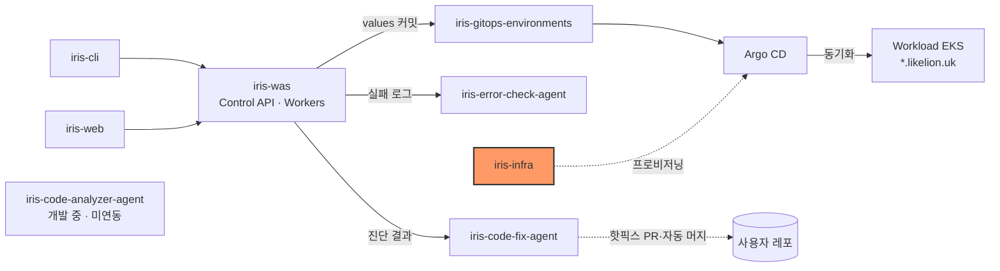
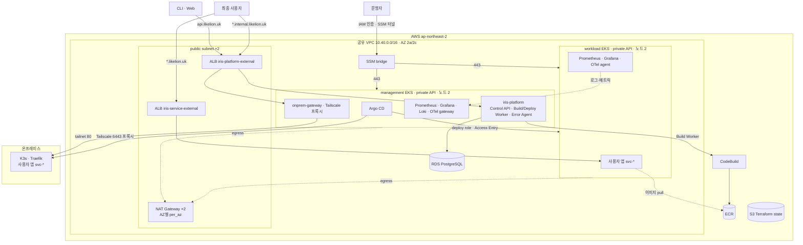

# iris-infra

Likelion의 AWS 인프라(Terraform), 두 EKS의 공통 설정·Helm/GitOps, 운영 절차를 관리한다. API/Worker의 배포 오케스트레이션과 서비스 소스는 각 서비스 저장소가 관리한다.


## 시스템 내 위치



- 이 저장소가 만든 Argo CD가 [iris-gitops-environments](https://github.com/2026-softbank-1/iris-gitops-environments)의 사용자 앱 values와 플랫폼 digest를 읽어 배포한다.
- 플랫폼 이미지는 [iris-was](https://github.com/2026-softbank-1/iris-was)·[iris-error-check-agent](https://github.com/2026-softbank-1/iris-error-check-agent)가 게시한다.

## 아키텍처



- EKS API public endpoint는 만들지 않는다. Argo/Grafana는 SSM 터널을 거쳐 로컬 port-forward로 접근한다.
- 외부 ALB는 클러스터마다 1개이며 baseline의 앵커 Ingress가 유지한다. 모르는 host는 404로 응답한다.
- 사용자 앱은 Deploy Worker가 `iris-gitops-environments`에 values를 커밋하고, Argo ApplicationSet이 `iris-service` chart의 고정 Git tag로 배포한다([ADR 0002](docs/decisions/0002-gitops-deployment.md)). 두 ApplicationSet은 AppProject `iris-svc-project`(`svc-*` namespace)를 공유하고, 디렉터리가 삭제되면 Application과 리소스도 삭제한다(`applicationsSync: sync` + resources finalizer). Argo CD는 같은 읽기 전용 자격 증명으로 두 저장소를 읽는다.

| 타깃 | ApplicationSet | values 경로 | chart |
| --- | --- | --- | --- |
| prod (workload EKS) | `iris-svc-appset` | `services/*/prod` | `iris-service-0.9.0` (Argo Rollouts, 프로젝트 내부 통신·개발용 DB) |
| onprem (K3s) | `iris-svc-onprem-appset` | `services/*/onprem` | `iris-service-0.6.0` (Deployment·롤링) |

- 비용 구성: 노드 4대(m7i-flex.large On-Demand, 클러스터당 2a/2c 1대씩), NAT는 `per_az`(2개)가 기본값이다.

상세 네트워크·IAM·스토리지 경계는 [docs/architecture.md](docs/architecture.md)에 있다.

## 디렉터리와 책임

| 위치 | 책임 |
| --- | --- |
| `terraform/bootstrap/aws` | 보호된 S3 state 버킷 |
| `terraform/account/aws` | 관리자 선적용 GitHub OIDC/CI IAM |
| `terraform/environments/aws/dev/foundation` | 공유 VPC·AZ별 NAT·SSM bridge·Argo IAM·CodeBuild/ECR·RDS·Route53/ACM |
| `terraform/environments/aws/dev/management` | 관리 EKS·노드·Argo/Build Worker Pod Identity |
| `terraform/environments/aws/dev/workload` | 앱 EKS·노드·운영자/Argo Access Entry |
| `terraform/modules/eks` | EKS 1.35·AZ별 MNG·managed addon·SG·IAM |
| `helm/bootstrap` | 관리 EKS Argo CD Helm 설치 |
| `helm/gitops` | 두 EKS의 baseline/LBC/metrics/monitoring·platform·사용자 앱 Applications |
| `helm/charts`, `clusters` | baseline·iris-service·iris-platform·on-prem gateway·ALB log collector chart 및 target별 values |
| `collectors`, `runtime` | ALB access-log collector 소스, Code Fix·on-prem 인증 갱신 런타임 매니페스트 |
| `local` | 로컬 k3d 설정 예시 |
| `scripts`, `contracts`, `docs/runbooks` | 검증·API 접근·연동 계약·운영 |
| `examples` | 서비스 values·ECR 빌드 workflow 템플릿 |

## 빠른 시작 (검증)

Terraform **1.16.4**, AWS provider **6.67.0** lock, Helm **3.19.1**, Python 3 + `PyYAML==6.0.3`을 사용한다. 운영에는 kubectl **1.35**, AWS CLI v2, Session Manager plugin도 준비한다.

```bash
make scaffold-check
make tf-check
make tf-test
python3 scripts/tests/test-tf-ci.py
python3 scripts/tests/test-eks-ops.py
make helm-check
```

mock/정적/렌더 검사는 AWS 배포나 IAM 충분성·실제 네트워크 연결을 증명하지 않는다. 테스트는 실제 backend/state/tfvars 대신 임시 데이터 디렉터리와 복사본을 사용한다. provider/chart 다운로드에는 인터넷 접근이 필요하다. 팀 명령 전체는 [scripts/README.md](scripts/README.md)에 있다.

## 인터페이스

- 사용자 앱 desired state: `iris-gitops-environments/services/{service_id}/{prod|onprem}/values.yaml`
- 플랫폼 digest: `iris-gitops-environments/platform/aws-dev-management/<repo>.yaml` → Argo Application `iris-platform`이 `clusters/aws-dev-management/values/platform.yaml`과 병합한다. 대상 repo는 `helm/gitops/values.yaml`의 `platform.repos`이며 파일이 없으면 건너뛴다(`ignoreMissingValueFiles`).
- 이미지: 플랫폼 ECR은 서비스 저장소 main publisher, 사용자 앱 `iris/services/*`는 Build Worker가 만든다.
- 연동 계약: [contracts/](contracts/README.md) ([target](contracts/target.md), [배포](contracts/deployment.md), [트래픽](contracts/service-traffic.md))

## 배포

**main merge 후 check → bootstrap → foundation → management → workload가 자동 apply된다.** account는 관리자가 먼저 적용하며 CI는 account를 변경하지 않는다. 계정/기존 state·CIDR·Free EKS 사용 가능 여부·quota를 확인하고 GitHub `EKS_OPERATOR_PRINCIPAL_ARN`과 2시간 CI role session을 준비한 후 사용자가 merge한다. 기본값 변경은 CI의 대응 `TF_VAR_*`도 맞춰야 하며 `.example`은 CI에서 읽지 않는다.

- apply 대상은 `scripts/terraform-ci-changes.py`가 diff로 판정한다. `.md` 파일만 바뀐 push는 check만 돌고 apply job은 skip된다([CI runbook](docs/runbooks/terraform-ci.md)).
- 인프라가 적용되면 [private API/기본 스택 runbook](docs/runbooks/eks-access.md)의 출력 export·두 SSM 터널·검토 SHA와 private Git credential 준비를 거쳐 `make bootstrap CLUSTER=aws-dev-management`를 실행한다. 플랫폼 Application은 `GITOPS_PLATFORM_ENABLED=1`로 bootstrap할 때 생성된다([플랫폼 배포](docs/runbooks/deploy-platform.md)).
- 실제 tfvars/backend/state/plan/Secret/kubeconfig는 Git에 올리지 않는다. 기존 빌드/ECR/state를 보존하는 [철거 절차](docs/runbooks/teardown.md)를 사용하며 foundation 전체 destroy나 자동 철거는 제공하지 않는다.

## 현재 상태 / 한계

- 구현: 공유 VPC·빌드 자원·ECR·RDS, private 관리/앱 EKS, SSM API 접근, Argo CD, 두 클러스터의 관측 스택, `iris-service`·`iris-platform` chart, on-prem 배포 타깃·gateway.
- 로컬 k3d는 설정 예시(`local/k3d.yaml.example`)만 있는 scaffold다.
- Code Analyzer는 `platform.repos`에 등록돼 있지만 gitops에 digest 파일이 없어 렌더링되지 않는다. 서비스화는 후속 범위다.
- 코드 구현과 실제 AWS/Kubernetes 적용 상태는 다르다. 운영 확인은 state/plan과 smoke 결과로 판단한다.
- 노드·Prometheus·Grafana·Loki는 AZ 종속 단일 replica라 HA가 아니다.

## 문서

- [아키텍처](docs/architecture.md), [설계 결정(ADR)](docs/decisions/README.md), [계정 준비](docs/runbooks/bootstrap.md), [main 자동 apply/CI](docs/runbooks/terraform-ci.md)
- [API 접근·Argo·관측 스택](docs/runbooks/eks-access.md), [로그·메트릭 수집](docs/runbooks/observability.md), [플랫폼 배포](docs/runbooks/deploy-platform.md)
- [사용자 환경변수(Sealed Secrets)](docs/runbooks/sealed-secrets.md), [사용자 서비스 배포 방식(Argo Rollouts)](docs/runbooks/argo-rollouts.md)
- [On-prem gateway](docs/runbooks/onprem-gateway.md), [On-prem E2E](docs/runbooks/onprem-portfolio-e2e.md), [사용자 온프레미스 서버 등록](docs/runbooks/onprem-server-registration.md)
- [문제 확인](docs/runbooks/troubleshooting.md), [철거](docs/runbooks/teardown.md)
- [팀 명령](scripts/README.md), [target 계약](contracts/target.md), [서비스 ECR 빌드 템플릿](examples/github-actions/README.md)
