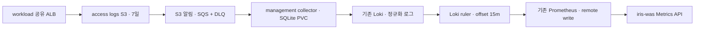

# 서비스 외부 트래픽 지표 (초안 v2)

소비자는 iris-was Metrics API와 프론트입니다. 인프라 구현과 로컬 검증은 준비됐으며, 실제 dev 배포·트래픽 검증과 소비자 연동은 별도입니다. 기존 management Prometheus를 내부에서 조회합니다. 공개 endpoint를 추가하지 않습니다.



## 지표 계약

모든 서비스 지표는 **gauge**입니다. 공통 라벨은 `cluster="iris-dev-workload"`, `k8s_namespace_name="svc-{id}"`입니다. 서비스별 Pod 수나 TargetGroup 수와 무관하게 이 두 라벨로 합쳐집니다.

| Prometheus 이름 | 추가 라벨 | 단위·의미 |
|---|---|---|
| `iris_service_requests_1m` | 없음 | 해당 1분 구간에 완료된 ALB 로그 건수 |
| `iris_service_errors_1m` | `status_class="4xx"` 또는 `"5xx"` | 해당 1분 구간의 ALB 최종 응답 코드별 건수 |
| `iris_service_public_network_bytes_1m` | `direction="receive"` 또는 `"transmit"` | 해당 1분 구간의 ALB `received_bytes` / `sent_bytes`, bytes |
| `iris_service_response_time_seconds_avg5m` | 없음 | 해당 5분 구간의 유효한 `target_processing_time` 평균, seconds |
| `iris_service_response_time_seconds_p50_5m` | 없음 | 동일 구간의 p50, seconds |
| `iris_service_response_time_seconds_p95_5m` | 없음 | 동일 구간의 p95, seconds |

오류는 **사용자에게 반환한 ALB 상태 코드**입니다. TargetGroup이 있는 ALB 오류와 target 응답 오류를 포함하며, TargetGroup이 없는 redirect·default action·차단 응답은 서비스에 귀속하지 않습니다. Target 상태 코드는 정규화 로그에 별도로 보존합니다.

응답 시간은 ALB가 target에 요청을 보낸 뒤 응답 헤더를 받기까지입니다. 클라이언트의 전체 다운로드 시간이나 브라우저 체감 응답 시간이 아닙니다. `-1`은 분위수·평균에서 제외합니다. WebSocket은 연결 종료 시 기록됩니다.

공용 바이트는 **이 외부 ALB를 통과한 요청·응답 바이트**입니다. 앱이 외부로 호출한 egress, Pod 내부 네트워크, TCP/TLS 오버헤드, AWS 청구 전송량을 포함하지 않습니다.

## 시간·결측 처리

하나의 ruler group을 1분마다 평가하며 모든 식에 `offset 15m`을 적용합니다. Prometheus 샘플 시각 `T`는 **평가 시각**입니다.

- 요청·오류·바이트: 이벤트 시각 `(T-16m, T-15m]`, 인접 구간은 겹치지 않습니다.
- 지연 평균·분위수: 이벤트 시각 `(T-20m, T-15m]`, 5분 rolling window입니다.
- 그래프에서 이벤트 시간으로 표시할 때 샘플 시각을 15분 앞당깁니다. 최신 15분은 집계 대기 영역입니다.
- 15분은 보장된 최대 지연이 아닙니다. ALB 파일 전달·큐 지연이 집계 대기 시간을 넘으면 과거 Prometheus 샘플은 자동 수정되지 않습니다.
- 로그가 있는 분에 4xx·5xx가 없으면 오류 값은 0입니다. 로그가 없는 서비스/분, 평가 실패·중단은 **결측**입니다. 가용성·수집 상태를 확인하기 전 0으로 바꾸지 않습니다.
- Prometheus instant/query_range의 기본 lookback은 이전 값을 보여줄 수 있습니다. API는 `timestamp(metric)`으로 실제 샘플 시각을 확인하고, 기대 평가 시각보다 오래된 샘플을 결측 처리해야 합니다. 스크랩 간격으로 같은 값을 반복 합산하지 않습니다.

## was 조회 예시

아래 예시는 management 내부 Prometheus에서 실행합니다. 서비스 ID는 인증된 서비스에서 만들고 쿼리 문자열에 임의 입력을 그대로 삽입하지 않습니다.

```promql
# 분당 요청 수. 전체 집계는 1m 샘플 또는 실제 원시 샘플 기준으로 계산.
iris_service_requests_1m{cluster="iris-dev-workload",k8s_namespace_name="svc-123"}

# 5xx 오류 비율. 분모 0 또는 결측은 비율 없음. % 표시 시 100을 곱함.
iris_service_errors_1m{cluster="iris-dev-workload",k8s_namespace_name="svc-123",status_class="5xx"}
/ ignoring(status_class)
iris_service_requests_1m{cluster="iris-dev-workload",k8s_namespace_name="svc-123"}

# 1시간 동안 평가된 실제 샘플의 요청 합계(이벤트 구간은 15분 과거).
sum_over_time(iris_service_requests_1m{cluster="iris-dev-workload",k8s_namespace_name="svc-123"}[1h])

# 초당 요청/바이트로 표시할 경우 해당 1분 값 / 60.
iris_service_public_network_bytes_1m{cluster="iris-dev-workload",k8s_namespace_name="svc-123",direction="transmit"} / 60

# 응답 p95. UI에서 ms를 표시하려면 1000을 곱함.
iris_service_response_time_seconds_p95_5m{cluster="iris-dev-workload",k8s_namespace_name="svc-123"}
```

이 gauge에 `rate()`·`increase()`를 사용하지 않습니다. 이미 집계한 p50·p95를 더하거나 평균내어 더 긴 구간의 분위수로 표시하지 않습니다. 긴 구간의 정확한 분위수는 원본 Loki 로그에서 다시 계산해야 합니다. 결측이 있으면 부분 합계임을 표시합니다.

## 서비스 매핑·품질

TargetGroup 이름을 파싱하지 않습니다. ELB Describe API의 `elbv2.k8s.aws/cluster`, `ingress.k8s.aws/stack`, `ingress.k8s.aws/resource` 태그로 workload 클러스터·공유 Ingress group·namespace를 확인합니다. 실제 설치된 LBC의 태그 형식은 배포 전 확인 대상입니다.

collector는 시작·재시작 후 첫 정상 매핑 조회를 완료해야 큐를 소비하며 60초마다 갱신합니다. ALB 식별자·TargetGroup 매핑·조회 시각은 전체 조회와 SQLite 저장이 성공한 경우에만 함께 갱신합니다. 마지막 정상 매핑과 확인한 ALB 식별자는 PVC에 7일 보관하여 같은 Ingress group의 교체 전 ALB 지연 로그를 처리합니다. AWS account·region·cluster·group이 다른 state는 재사용하지 않습니다. 아직 확인하지 못한 같은 group의 ALB 또는 TargetGroup이면 최대 5분 동안 객체를 재시도한 뒤 `mapping` 진단과 DLQ에 남깁니다. URL·query·IP·User-Agent는 Loki로 복사하지 않습니다. 원본 S3 로그에는 이 정보가 있으므로 접근 권한과 7일 보존을 적용합니다.

`iris_alb_log_collector_ready`, `iris_alb_log_collector_mapping_timestamp_seconds`, `iris_alb_log_collector_records_total{reason}`, `iris_alb_log_collector_operations_total{reason}`와 큐의 oldest-message age, Loki ruler 평가·remote-write 상태를 함께 확인합니다. `late`는 15분보다 늦게 처리된 로그로 다른 실패 원인과 중복될 수 있습니다.

collector의 outbox 본문·객체별 진단은 최초 수신 후 7일이 지나면 완료 여부와 무관하게 정리 대상이 됩니다. AWS/Loki/DLQ 장애 중에도 제한된 배치로 정리하며, 미완료 객체는 `expired`로 종료합니다. 완료/만료 후 14일간 남는 작은 체크포인트로 같은 알림의 재전송을 막습니다. `records_total{reason="expired"}`는 정리 당시 로컬 pending 레코드 수이며 ack 유실로 Loki에 이미 수락된 레코드도 포함할 수 있습니다. 확정 누락 건수가 아니며 만료가 별도 DLQ 알림이나 과거 지표 복원을 수행하지 않습니다.

ALB access logs는 best effort입니다. 체크포인트와 동일 timestamp/body replay로 SQS 중복 알림과 ack 유실을 처리하지만 exactly-once를 보장하지 않습니다. 다른 S3 객체로 중복 전달된 같은 요청까지 제거하는 요청 식별자는 없습니다. 이 지표는 청구·정산용이 아닙니다.

원본 7일 보존은 Loki의 7일 재입력 허용을 의미하지 않습니다. 기존 Loki ingest limits를 유지하고 `too_old`·`too_far_behind`는 영구 실패로 분류합니다. 복구는 원본의 별도 분석/제한된 재처리로 수행하며, 과거 recording samples를 자동 backfill하지 않습니다.

ALB 필드 정의·best effort·WebSocket 시각은 [AWS access-log 명세](https://docs.aws.amazon.com/elasticloadbalancing/latest/application/load-balancer-access-logs.html), SSE-S3·리전·delivery policy 조건은 [AWS 활성화 절차](https://docs.aws.amazon.com/elasticloadbalancing/latest/application/enable-access-logging.html)를 기준으로 합니다.

## 향후 CloudWatch 전환

수집원을 바꾸더라도 was가 선택하는 서비스 라벨은 유지할 수 있습니다. 다만 CloudWatch의 가용 차원, 상태 코드 범위, latency 통계와 바이트 방향 지원을 실제로 확인한 뒤 계약을 버전 변경해야 합니다. 특히 ALB `ProcessedBytes`를 서비스별 ingress/egress 두 값으로 곧바로 치환할 수 있다고 가정하지 않습니다. 기존 gauge와 counter를 섞지 않고, 전환 구간의 지연·결측 의미도 함께 바꿉니다.
