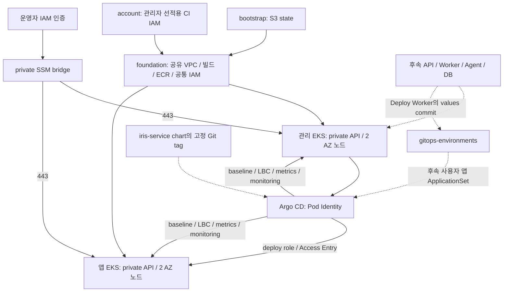

# 아키텍처

현재 Terraform은 bootstrap/account/foundation과 관리·앱 EKS를 구현합니다. Helm bootstrap은 Argo CD와 GitOps root를, Argo는 공통 addon을 설치합니다. iris-service chart는 구현됐고 사용자 앱 배포는 GitOps입니다. 플랫폼 chart와 로컬 k3d는 scaffold입니다. 코드 구현과 실제 적용 상태는 다르며 운영 확인은 state/plan 및 smoke 결과로 판단합니다.

두 EKS stack은 **foundation만 참조**합니다. 상대 EKS state를 읽는 순환 의존은 없습니다. foundation의 Argo management role을 관리 EKS의 3개 SA가 Pod Identity로 사용하고, management/workload deploy role을 assume합니다. 두 deploy role과 명시한 운영자 principal은 cluster-admin Access Entry를 사용합니다. AppProject의 제한은 Argo 동기화 경계이며 IAM/RBAC의 cluster-admin 권한을 줄이지 않습니다.

Terraform은 VPC·SG·IAM·EKS·노드·CNI/CoreDNS/kube-proxy/Pod Identity/EBS CSI를 소유합니다. Helm bootstrap은 Argo 자체·Git credential·cluster Secret·root AppProject/Application을 소유합니다. 이번 bootstrap은 baseline/LBC/metrics-server/kube-prometheus-stack Applications를 생성합니다. 사용자 앱은 [ADR 0002](decisions/0002-gitops-deployment.md)에 따라 Deploy Worker가 `gitops-environments/services/{service_id}/prod/values.yaml`을 커밋하고 Argo ApplicationSet이 `iris-service`의 고정 Git tag와 values로 배포합니다. Deploy Worker는 앱 EKS API에 접근하지 않습니다. 사용자 앱 ApplicationSet·별도 GitOps 저장소 자격 증명 연결은 후속 범위이며 addon AppProject와 구분합니다. ALB가 필요하면 LBC/Ingress가 만들며 Terraform이 ALB를 중복 선언하지 않습니다.

네트워크는 공유 VPC `10.40.0.0/16`, AZ `ap-northeast-2a/c`, public 2개, management/workload private 각 2개입니다. public은 IGW, private은 기본적으로 같은 AZ의 NAT로 나갑니다. 기존 슬롯 0 NAT/EIP를 유지하고 슬롯 1을 추가합니다. `single`을 선택하면 AZ 간 비용과 한 NAT AZ 장애의 영향을 받아 노드 2대만으로 외부 통신 HA를 보장하지 않습니다. 노드와 bridge는 공인 IP 없이 실행합니다.

관리 node ENI에는 source SG, 앱 control plane에는 target SG를 연결하여 관리→앱 API TCP 443을 허용합니다. bridge는 별도의 SG로 두 API의 443만 접근합니다. SG는 합산되며 management의 source SG를 공유하는 다른 Pod도 같은 네트워크 접근 범위를 가질 수 있습니다. IAM·Access Entry·NetworkPolicy는 별도의 제어입니다. 서브넷 분리만으로 보안 격리를 보장하지 않습니다.

기본 외부 인바운드는 없습니다. 후속 사용자 서비스는 **DNS → public ALB HTTPS → private 앱 Pod**이며 인증서·앱 포트 SG·헬스 체크·application NetworkPolicy를 함께 설정합니다. 사용자 앱은 ADR 0002의 ALB Ingress group으로 ALB 하나를 공유합니다. Argo/Grafana는 ClusterIP와 로컬 port-forward를 사용합니다. NAT는 private 자원의 외부 요청과 응답에 사용합니다.

두 AZ에 MNG 1개씩 고정 1노드를 두고 maxPods=35/prefix delegation을 사용합니다. LBC/metrics는 replica 2와 완화된 AZ spread로 장애 후 남은 노드에 재배치할 수 있습니다. Prometheus 20Gi(3d/15GB), Grafana 5Gi, Alertmanager 2Gi는 각 클러스터에서 단일 replica·AZ 종속 gp3를 사용하여 HA가 아닙니다. 사용자 앱/DB HA는 후속 설계입니다.

foundation의 기존 Build Worker/CodeBuild/ECR 경계를 유지합니다. management에는 기존 Build Worker SA의 Pod Identity만 연결하며 실제 Worker·GitOps 저장소 연동과 사용자 앱 ApplicationSet은 후속 플랫폼 구현입니다. Build/Deploy Worker에 앱 EKS Access Entry를 주지 않습니다. 플랫폼 ECR 3개는 서비스 저장소의 main publisher가 게시하고 사용자 앱 `iris/services/*`는 기존 Build Worker가 만듭니다. ECR 이미지가 없어도 addon 설치는 가능하며 pull은 존재하는 digest로 별도 검사합니다.

소스 SHA·배포 이력은 플랫폼 DB, 사용자 앱의 desired state는 `gitops-environments`, 이미지는 ECR, Terraform state는 S3에 저장합니다. 사용자 배포마다 이 저장소에 프로젝트 디렉토리나 commit을 만들지 않습니다. 로컬 CLI는 같은 `iris-service` chart 버전으로 k3d에 배포하며 `iris-web` 정적 사이트 배포는 후속 범위입니다.

비밀값과 전체 state는 Git/GitOps values에 넣지 않습니다. 검토한 immutable SHA가 addon values를 고정합니다. [운영 경로](runbooks/eks-access.md), [결정](decisions/0003-private-eks-and-gitops.md), [target 계약](../contracts/target.md)을 참고합니다.
