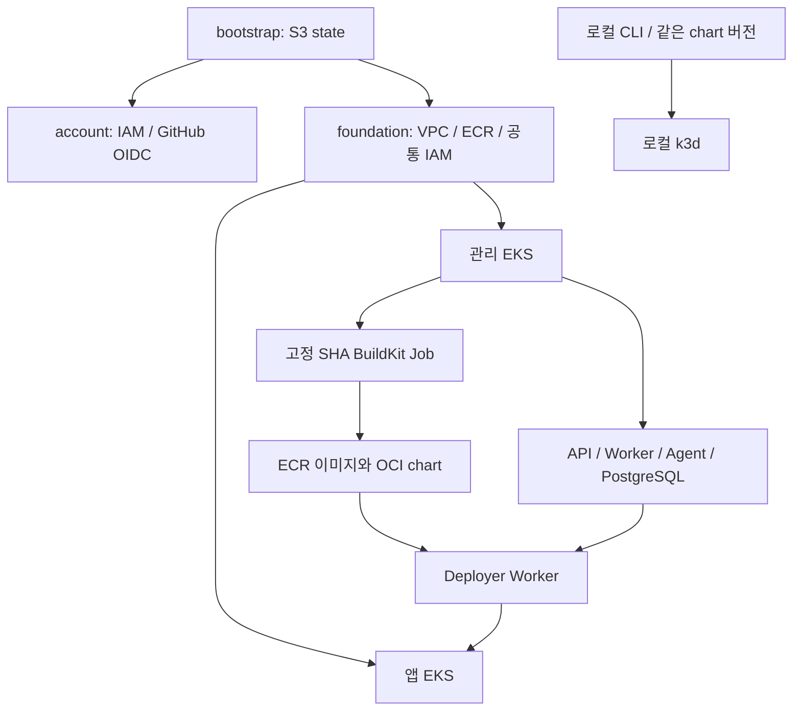

# 아키텍처

초기 대상은 AWS 관리 EKS, AWS 앱 EKS, 로컬 k3d입니다. 현재 bootstrap의 S3 state,
account의 GitHub CI OIDC·네트워크 CI 권한, foundation의 공유 VPC 네트워크와
CodeBuild·빌드 입력 S3·로그·빌드 역할·플랫폼 ECR을 구현했습니다.
EKS와 플랫폼 배포는 아직 scaffold이며 아래 그림은 목표 아키텍처입니다.

Terraform은 AWS 자원과 EKS·node group·관리형 addon·IAM·Access Entry를 소유합니다.
Helm bootstrap은 baseline과 외부 addon을, 플랫폼 chart는 플랫폼 워크로드를 소유합니다.
사용자 앱 release는 Worker가 iris-service로 관리합니다. ALB는 컨트롤러가 소유하며 Terraform에서 중복 선언하지 않습니다.

플랫폼 서비스는 각 GitHub 저장소의 main에서 OIDC publisher 역할로 `iris/was`,
`iris/code-analyzer-agent`, `iris/error-check-agent`에 이미지를 게시합니다.
foundation이 저장소를 소유하고 account가 exact repository ARN과 GitHub subject로 IAM 범위를 정합니다.
사용자 앱의 `iris/services/*` 생성·CodeBuild push와 캐시는 기존 Build Worker 경로를 사용합니다.
`iris-web`은 정적 사이트로 별도 후속 배포합니다. [빌드 템플릿](../examples/github-actions/README.md)의 digest 출력을 후속 배포가 사용합니다.

foundation의 공통 Worker 역할을 management의 Pod Identity와 workload의 Access Entry가 참조합니다.
두 클러스터가 상대 state를 읽는 순환 의존은 만들지 않습니다. 공유 VPC 경로·보안 그룹으로 관리→대상 API 접근을 구현합니다.
IAM 인증과 Namespace RBAC를 함께 검증합니다. NetworkPolicy는 CNI의 실제 enforcement를 확인합니다.

공유 VPC의 두 AZ에 public subnet 2개, 관리용 private subnet 2개, 앱용 private subnet 2개를 둡니다.
public은 IGW, private은 NAT 기본 경로를 사용하고 노드용 자동 공인 IP 할당은 끕니다.
외부 ALB는 public에서 요청을 받아 private의 앱으로 전달하며 Load Balancer Controller가 후속 생성합니다.
기본 단일 zonal NAT는 개발 비용을 줄이지만 해당 AZ 장애 시 두 AZ의 외부 통신이 중단될 수 있습니다.
`per_az`는 AZ별 NAT를 사용합니다. CIDR·AZ·태그와 출력 계약은 [foundation README](../terraform/environments/aws/dev/foundation/README.md)에 있습니다.

foundation의 source/target SG는 관리→앱 private Kubernetes API TCP 443 규칙만 정의합니다.
후속 management가 Worker 송신 ENI에 source SG를, workload가 control plane에 target SG를 연결합니다.
EKS 기본 SG·노드 통신은 재사용 모듈이 소유합니다. 실제 접근은 기존 SG 합산 규칙과 IAM/RBAC를 함께 검증하며,
이번 네트워크 기반 구현만으로 실제 연결이나 클러스터 격리가 완성되지는 않습니다.

소스 SHA·배포 이력은 플랫폼 DB, 실제 env는 SSM·Kubernetes Secret, 이미지·chart package는 ECR,
state는 S3에 저장합니다. 사용자 배포마다 이 저장소에 프로젝트 디렉토리나 commit을 만들지 않습니다.
