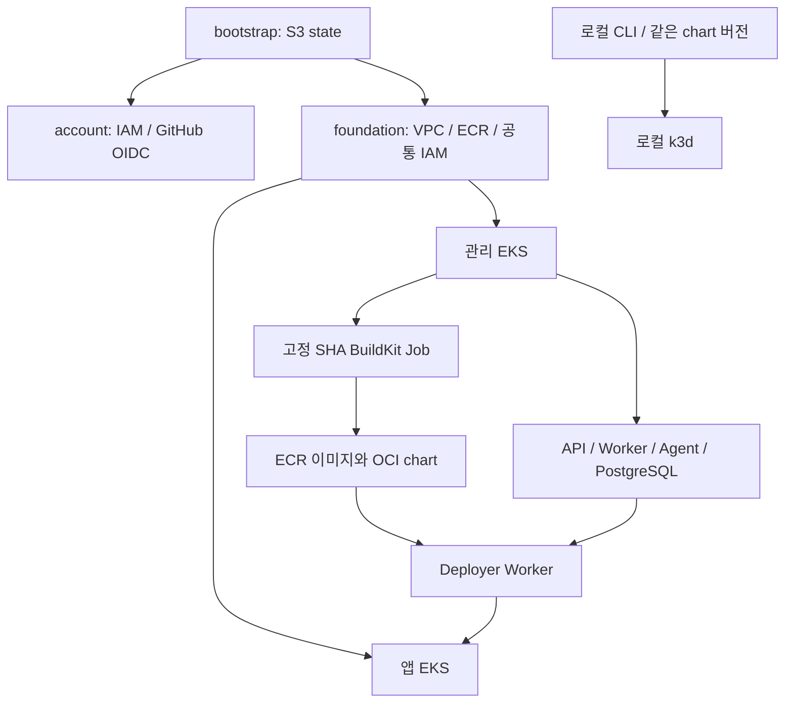

# 아키텍처

초기 대상은 AWS 관리 EKS, AWS 앱 EKS, 로컬 k3d입니다. 현재 bootstrap의 S3 state,
account의 GitHub CI OIDC, foundation의 CodeBuild·빌드 입력 S3·로그·빌드 역할을 구현했습니다.
네트워크·EKS와 플랫폼 배포는 아직 scaffold이며 아래 그림은 목표 아키텍처입니다.

Terraform은 AWS 자원과 EKS·node group·관리형 addon·IAM·Access Entry를 소유합니다.
Helm bootstrap은 baseline과 외부 addon을, 플랫폼 chart는 플랫폼 워크로드를 소유합니다.
사용자 앱 release는 Worker가 iris-service로 관리합니다. ALB는 컨트롤러가 소유하며 Terraform에서 중복 선언하지 않습니다.

foundation의 공통 Worker 역할을 management의 Pod Identity와 workload의 Access Entry가 참조합니다.
두 클러스터가 상대 state를 읽는 순환 의존은 만들지 않습니다. 공유 VPC 경로·보안 그룹으로 관리→대상 API 접근을 구현합니다.
IAM 인증과 Namespace RBAC를 함께 검증합니다. NetworkPolicy는 CNI의 실제 enforcement를 확인합니다.

소스 SHA·배포 이력은 플랫폼 DB, 실제 env는 SSM·Kubernetes Secret, 이미지·chart package는 ECR,
state는 S3에 저장합니다. 사용자 배포마다 이 저장소에 프로젝트 디렉토리나 commit을 만들지 않습니다.
