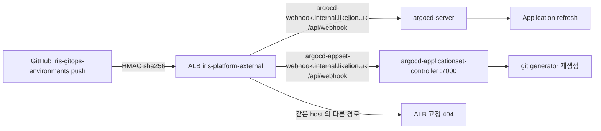

# Argo CD GitHub webhook

Argo CD 는 기본적으로 Git 을 약 3분마다 polling 합니다(2026-10-04 측정: GitOps 커밋 → ApplicationSet 이 `svc-37` Application 을 만들기까지 119초). `iris-gitops-environments` 의 push 를 webhook 으로 받아 바로 반영합니다.



| 구성 | 위치 |
|---|---|
| Ingress 2개 | `helm/charts/iris-argocd-webhook`, Application·AppProject `iris-argocd-webhook`(Ingress 만 허용) |
| host | `*.internal.likelion.uk` 아래. 이미 management ALB 를 가리키고 ALB 인증서가 덮어 DNS·인증서 변경 없음 |
| 공유 비밀 | `argocd/argocd-secret` 의 `webhook.github.secret`(server·ApplicationSet controller 가 같이 씀). Git 에 없음 |
| GitHub hook | `iris-gitops-environments` 저장소 hook 2개(push, JSON, 같은 secret) |

- 두 endpoint 모두 서명을 확인합니다. **`webhook.github.secret` 이 비어 있으면 서명 없는 요청도 받으므로** Ingress 보다 먼저 넣습니다.
- `argocd-secret` 은 bootstrap Helm release(`argocd`)가 만들었지만 이 키는 chart 값에 없어 kubectl 로 넣습니다. Helm 3-way merge 는 live 에만 있는 키를 지우지 않아 bootstrap 을 다시 해도 남습니다. Argo 가 관리하는 리소스가 아니라 selfHeal 이 되돌리지도 않습니다.
- argocd-server 는 secret 이 바뀌면 스스로 다시 읽습니다. ApplicationSet controller 는 시작할 때 읽으므로 다시 시작합니다.
- argocd namespace 의 NetworkPolicy 는 argocd-server 로의 ingress 를 막지 않고 ApplicationSet controller 에는 NetworkPolicy 가 없어 따로 열지 않습니다.

## 설정

management context(`$M`)와 GitHub 저장소 admin 권한이 필요합니다. secret 은 출력하지 않습니다.

```bash
umask 077; openssl rand -hex 32 > /tmp/argocd-webhook-secret
kubectl $M -n argocd patch secret argocd-secret --type merge \
  -p "{\"stringData\":{\"webhook.github.secret\":\"$(cat /tmp/argocd-webhook-secret)\"}}"
kubectl $M -n argocd rollout restart deploy/argocd-applicationset-controller
kubectl $M -n argocd logs deploy/argocd-server --since=2m | grep -i 'github secret'   # 다시 읽었는지
```

이 chart 를 merge 해 Ingress 를 만든 뒤 hook 두 개를 만듭니다.

```bash
for host in argocd-webhook argocd-appset-webhook; do
  gh api repos/2026-softbank-1/iris-gitops-environments/hooks -X POST \
    -f name=web -F active=true -f 'events[]=push' \
    -f config[url]=https://$host.internal.likelion.uk/api/webhook \
    -f config[content_type]=json -f config[insecure_ssl]=0 \
    -f config[secret]="$(cat /tmp/argocd-webhook-secret)" --jq '.id'
done
rm -P /tmp/argocd-webhook-secret
```

## 확인

```bash
curl -s -o /dev/null -w '%{http_code}\n' https://argocd-webhook.internal.likelion.uk/            # 404 (ALB)
curl -s -o /dev/null -w '%{http_code}\n' https://argocd-webhook.internal.likelion.uk/api/version # 404 (ALB)
gh api repos/2026-softbank-1/iris-gitops-environments/hooks --jq '.[] | [.id, .config.url, .last_response.code] | @tsv'
gh api repos/2026-softbank-1/iris-gitops-environments/hooks/<id>/deliveries --jq '.[0] | [.delivered_at, .status_code, .event] | @tsv'
kubectl $M -n argocd logs deploy/argocd-server --since=10m | grep -i 'webhook\|refresh'
kubectl $M -n argocd logs deploy/argocd-applicationset-controller --since=10m | grep -i webhook
```

GitHub 의 ping 이벤트는 Argo 가 처리하지 않을 수 있습니다. push delivery 가 200 이고 Argo 로그에 refresh 가 남는지 봅니다.

## 교체

새 secret 으로 위 patch·restart 를 하고 두 hook 의 `config[secret]` 을 같은 값으로 `PATCH repos/.../hooks/<id>/config` 합니다. 그 사이 delivery 는 서명 불일치로 실패하고 Argo 는 polling 으로 계속 반영합니다.

## 되돌리기

1. hook 두 개를 지웁니다(`gh api -X DELETE repos/2026-softbank-1/iris-gitops-environments/hooks/<id>`). Argo 는 polling 으로 돌아갑니다.
2. 이 chart 의 Application 을 지우는 revert PR 을 merge 합니다. root 는 prune 하지 않으므로 Application `iris-argocd-webhook` 이 남으면 직접 지웁니다(prune 이 켜진 Application 이라 Ingress 도 함께 지워집니다).
3. `webhook.github.secret` 은 남겨도 됩니다(공개 경로가 없으면 쓰이지 않습니다).
