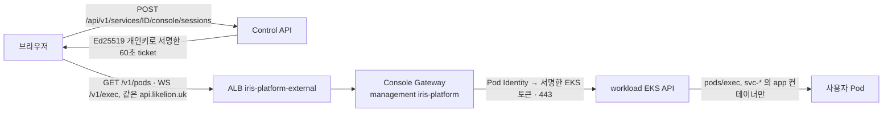

# 서비스 콘솔(Console Gateway)

사용자가 서비스 화면에서 실행 중인 Pod 의 `app` 컨테이너에 셸을 여는 경로의 인프라 쪽 절차입니다. 레포 간 계약은 iris-was `docs/console-api.md`, 결정 배경은 iris-was ADR 0033 입니다. 대상은 **AWS 타깃(workload EKS)만**이고 온프레미스 타깃은 다음 라운드입니다. 아래 확인 명령은 적용 후 실행하는 절차이며 `make helm-check`·`make tf-test` 의 렌더·mock 검사는 실제 클러스터·IAM·ALB 동작을 보장하지 않습니다. 첫 적용 때 결과를 이 문서에 반영합니다.



| 구성 | 위치 | 비고 |
|---|---|---|
| Gateway Deployment·Service·Ingress·NetworkPolicy·ConfigMap·SA | `helm/charts/iris-platform` 의 `consoleGateway` (`templates/console-gateway.yaml` 외) | 이미지는 iris-was 와 같고 실행 명령만 다릅니다. replica 1, `Recreate` |
| IAM role `iris-dev-console-gateway` | `terraform/environments/aws/dev/foundation/console-gateway-identity.tf` | Pod Identity 신뢰(`iris-platform/console-gateway`)만 있고 **권한 정책이 없습니다** |
| Pod Identity association | `terraform/environments/aws/dev/management/identity.tf` | SA `console-gateway` |
| workload EKS Access Entry | `terraform/modules/eks`(`console_gateway_role_arn`, workload root 만) | Kubernetes group `iris-console` 에만 매핑, **access policy 없음** |
| ClusterRole `iris-console-exec`·Binding·ValidatingAdmissionPolicy | `helm/charts/cluster-baseline` 의 `consoleExec`(workload values 에서 켬) | 권한의 유일한 출처입니다 |
| CI 의 role 관리 권한 | `terraform/account/aws/ci-control-api.tf`(기존 `control-api-deployment` 정책 문서의 `ConsoleGatewayRole`·`PassConsoleGatewayRole` 문장) | CI 가 이 역할 하나만 만들고 Pod Identity 로만 넘길 수 있게 합니다(권한 정책 put/attach 는 불가). 새 정책 문서를 만들지 않아 account-plan 검사기의 10개 문서 한도를 유지합니다 |

## 결정과 근거

- **공개 호스트는 API 와 같은 `api.likelion.uk`, 경로는 정확히 `/v1/pods`·`/v1/exec`** 입니다. 새 DNS 레코드(권한 DNS 가 Cloudflare 라 수동 작업)·인증서(`*.likelion.uk` 가 이미 덮음)·CORS origin 이 필요 없고, WebSocket 은 ALB 가 기본으로 지원합니다. Control API 는 `/api/v1/…` 아래에만 있어 겹치지 않습니다. 경로를 `/console-gateway/…` 같은 접두로 두면 ALB 가 접두를 지우지 못해 Gateway 가 접두를 직접 처리해야 하므로 쓰지 않았습니다.
- API Ingress 가 같은 host 의 `/`(전체)를 가지고 있어, Gateway Ingress 는 `group.order: "-1"` 로 먼저 평가되게 합니다. 이 값이 없으면 `iris-platform-api` 가 이름 순으로 앞서 `/v1/exec` 도 API 로 갑니다(404). 기본 인증서·앵커 설정은 건드리지 않습니다.
- ALB idle timeout 은 60초(그룹 공통 속성이라 바꾸지 않습니다). 화면과 Gateway 가 25초마다 ping 을 보내 연결을 유지합니다(iris-was 계약 §5).
- 서명 키는 비대칭입니다. Control API 만 개인키(`iris-platform` Secret `iris-console-ticket-signer`), Gateway 는 공개키(ConfigMap)만 가집니다. Gateway 에는 DB·Secret·AWS 권한이 없습니다. values schema 가 `ticketPublicKey` 에 `PUBLIC KEY` 헤더만 허용해 개인키를 values 에 넣는 실수를 막습니다.
- **Gateway 는 1개만** 띄웁니다(schema 가 `replicas` 를 1 로 제한). 1회용 ticket 검사(jti)가 메모리라서 두 Pod 가 동시에 있으면 같은 ticket 이 두 번 쓰일 수 있습니다. 그래서 `Recreate` 이고, 배포·재시작 때 열려 있는 콘솔은 끊겨 사용자가 다시 연결합니다.
- **ClusterRole 은 클러스터 전체**(`pods` get·list, `pods/exec` get·create)이지만, 같은 baseline 의 ValidatingAdmissionPolicy `iris-console-exec-scope` 가 group `iris-console` 의 exec 를 `svc-*` namespace 의 `app` 컨테이너로 한정합니다. Gateway 코드의 버그·침해가 `kube-system`·`observability`(privileged)·`iris-apps` 로 번지지 않게 하는 2차 방어입니다. 다른 caller(운영자·Argo CD)는 match condition 으로 건너뜁니다. 남는 범위: 모든 namespace 의 Pod 목록·spec 읽기(Secret 은 아님).
- `pods/exec` 에 `create` 만이 아니라 `get` 도 준 이유: Kubernetes 가 exec 의 WebSocket 업그레이드를 버전에 따라 `get` 또는 `create` 로 인가하기 때문입니다. 어느 쪽도 exec 외에는 아무것도 열지 않습니다. 사용 중인 EKS 1.35 에서 실제로 어느 verb 가 필요한지는 아래 검증에서 확인하고, 불필요하면 `get` 을 뺍니다.

## 값

| 어디에 | 이름 | 값 |
|---|---|---|
| Control API(ConfigMap, `consoleGateway.enabled` 와 Gateway digest 가 있을 때만) | `CONSOLE_GATEWAY_HTTP_URL` | `https://api.likelion.uk` |
| Control API(같음) | `CONSOLE_GATEWAY_WS_URL` | `wss://api.likelion.uk` |
| Control API(Secret `iris-console-ticket-signer`, 키 `CONSOLE_TICKET_PRIVATE_KEY`, optional) | `CONSOLE_TICKET_PRIVATE_KEY` | Ed25519 개인키 PEM |
| Gateway(ConfigMap `iris-platform-console-gateway`) | `CONSOLE_TICKET_PUBLIC_KEY` | 공개키 PEM(`consoleGateway.ticketPublicKey`) |
| Gateway | `CONSOLE_AWS_CLUSTER_NAME`·`_ENDPOINT`·`_CA` | `iris-dev-workload`·workload `target` 출력의 `endpoint`·`ca_data`(base64) |
| Gateway | `CONSOLE_ALLOWED_ORIGINS` | `https://app.likelion.uk` |
| Gateway | `CONSOLE_IDLE_TIMEOUT_SECONDS`·`CONSOLE_MAX_SESSION_SECONDS`·`CONSOLE_MAX_SESSIONS_PER_USER` | `900`·`3600`·`3` |
| Gateway | `AWS_REGION`·`LOG_LEVEL` | `ap-northeast-2`·`was.logLevel` |

API 는 Secret 이 없으면(optional) 콘솔을 `NOT_CONFIGURED` 로 보고합니다. Gateway digest 가 GitOps 에 없으면 API ConfigMap 에 Gateway 주소가 들어가지 않아 같은 결과입니다.

## 적용 순서

이 변경은 기능을 **켠 상태**(`consoleGateway.enabled: true`, 공개키·workload endpoint·CA 포함)로 들어갑니다. 운영자가 키 쌍과 Secret 을 미리 만들어 두었기 때문입니다(4단계). 다만 Gateway digest 가 GitOps 에 없는 동안은 ServiceAccount `console-gateway` 와 ConfigMap `iris-platform-console-gateway` 만 새로 생기고, Pod·Service·Ingress·NetworkPolicy 는 없으며 API 에는 Gateway 주소가 들어가지 않습니다(`helm template` 로 확인). workload baseline 에는 아무도 쓰지 않는 RBAC 객체 4개(ClusterRole·Binding·ValidatingAdmissionPolicy·Binding)가 추가됩니다. 참고로 `consoleGateway.enabled: false` 이면 platform 과 management baseline 의 렌더 결과가 이 기능 도입 전과 같습니다(Pod 재시작 없음).

### 0. 선행 조건(iris-was)

Gateway 이미지(`app.console_gateway.main:app`, `/healthz`·`/readyz`)가 iris-was main 에 있고, iris-was **Deploy platform** workflow 가 컴포넌트 `consoleGateway` 의 digest 를 `iris-gitops-environments/platform/aws-dev-management/was.yaml` 에 커밋할 수 있어야 합니다(`consoleGateway.digest`). 이 저장소는 digest 를 갖지 않습니다. 이 workflow 변경은 iris-was 쪽 작업입니다.

### 1. account(관리자, main merge 전)

`terraform/account/aws` 를 관리자 경로로 적용해 CI 역할의 기존 정책 `iris-dev-control-api-deployment` 에 Console Gateway 문장 2개가 더해지게 합니다(CI 역할의 임시 `AdministratorAccess` 가 남아 있으면 없어도 apply 는 되지만, 회수한 뒤에는 필수입니다). 새 관리형 정책을 붙이지 않으므로 CI 역할의 정책 수는 늘지 않습니다.

### 2. 이 변경 merge → CI 자동 apply

`terraform/environments/aws/dev/**`·`terraform/modules/**` 변경이라 main merge 가 foundation → management → workload 순으로 **자동 apply** 합니다([CI runbook](terraform-ci.md)). 만들어지는 것은 새 리소스뿐입니다(IAM role 1, Pod Identity association 1, EKS Access Entry 1). 기존 리소스는 바뀌지 않습니다. apply 후 확인:

```bash
aws iam get-role --role-name iris-dev-console-gateway --query 'Role.AssumeRolePolicyDocument'
aws iam list-role-policies --role-name iris-dev-console-gateway            # 비어 있어야 함
aws iam list-attached-role-policies --role-name iris-dev-console-gateway   # 비어 있어야 함
aws eks describe-access-entry --cluster-name iris-dev-workload --principal-arn arn:aws:iam::<계정>:role/iris-dev-console-gateway \
  --query 'accessEntry.kubernetesGroups'                                    # ["iris-console"]
aws eks list-associated-access-policies --cluster-name iris-dev-workload --principal-arn arn:aws:iam::<계정>:role/iris-dev-console-gateway
# → associatedAccessPolicies 가 비어 있어야 함(권한은 group 의 ClusterRole 만)
aws eks list-pod-identity-associations --cluster-name iris-dev-management --namespace iris-platform --service-account console-gateway
```

### 3. Argo root 확인

첫 적용에서는 root 가 `main` 을 추적하므로 **bootstrap 이 필요 없습니다**. merge 후 Argo 가 chart·values 를 자동으로 sync 합니다. root 가 특정 SHA 에 고정돼 있으면 merge 만으로는 반영되지 않으므로 먼저 상태를 봅니다.

```bash
kubectl --kubeconfig .generated/kubeconfig-aws-dev-management.json -n argocd get applications \
  -o custom-columns=NAME:.metadata.name,REV:.spec.source.targetRevision
```

고정돼 있으면 [eks-access 의 bootstrap 절차](eks-access.md#argo-cd와-기본-스택-설치)대로 merge SHA 로 `make bootstrap CLUSTER=aws-dev-management` 를 다시 실행합니다(그 사이 병합된 다른 변경도 함께 적용되므로 먼저 `git log` 로 범위를 확인합니다). 끝나면 workload baseline 에 RBAC 가 생겼는지, management 에 SA·ConfigMap 이 생겼는지 봅니다.

```bash
KC=.generated/kubeconfig-aws-dev-workload.json   # make eks-api-tunnel TARGET=aws-dev-workload 를 열어 둔 상태
kubectl --kubeconfig $KC get clusterrole,clusterrolebinding iris-console-exec
kubectl --kubeconfig $KC get validatingadmissionpolicy,validatingadmissionpolicybinding iris-console-exec-scope
kubectl --kubeconfig .generated/kubeconfig-aws-dev-management.json -n iris-platform get sa console-gateway cm/iris-platform-console-gateway
```

### 4. 키 쌍 생성과 Secret(운영자 로컬, 사람이 직접)

**첫 적용에서는 운영자가 이미 끝냈습니다**: Secret `iris-platform/iris-console-ticket-signer`(키 `CONSOLE_TICKET_PRIVATE_KEY`)를 management 에 만들었고 개인키는 로컬에서 지웠습니다. 아래는 다시 만들거나 교체할 때의 절차입니다. 개인키는 터미널에 출력하지 않고 Git·values·메신저에 남기지 않습니다. 임시 디렉터리에서 만들고 끝나면 지웁니다.

```bash
work="$(mktemp -d)"; chmod 700 "$work"
openssl genpkey -algorithm ED25519 -out "$work/console-ticket.pem"
openssl pkey -in "$work/console-ticket.pem" -pubout -out "$work/console-ticket.pub.pem"   # 이 공개키만 values 로
kubectl --kubeconfig .generated/kubeconfig-aws-dev-management.json -n iris-platform create secret generic iris-console-ticket-signer \
  --from-file=CONSOLE_TICKET_PRIVATE_KEY="$work/console-ticket.pem"
cat "$work/console-ticket.pub.pem"       # values 에 넣을 공개키(비밀 아님)
rm -rf "$work"                            # 개인키는 클러스터 Secret 에만 남김(필요하면 비밀번호 관리자에 따로 보관)
```

### 5. workload endpoint·CA 와 values(이 PR 에 포함)

`clusters/aws-dev-management/values/platform.yaml` 의 `consoleGateway` 는 **이 PR 에 이미 채워져 있습니다**(별도 values PR 없음). 공개키는 4단계에서 만든 공개키 PEM 전체(줄바꿈은 `\n`), endpoint 는 `https://` + workload `target` 출력의 `endpoint` 호스트, `ca` 는 `ca_data`(base64 그대로)입니다. 셋 다 비밀이 아닙니다. schema 가 `ticketPublicKey` 에 `PUBLIC KEY` 헤더만 허용하고 개인키 PEM 은 거절합니다(저장소 어디에도 개인키 헤더가 없음을 grep 으로 확인함).

```json
"consoleGateway": {
  "enabled": true,
  "ticketSigningSecret": "iris-console-ticket-signer",
  "ticketPublicKey": "-----BEGIN PUBLIC KEY-----\n…\n-----END PUBLIC KEY-----\n",
  "awsCluster": {"name": "iris-dev-workload", "endpoint": "https://….eks.amazonaws.com", "ca": "<ca_data>"},
  "allowedOrigins": ["https://app.likelion.uk"]
}
```

값을 다시 읽거나 클러스터를 새로 만들었을 때만 아래로 조회해 이 파일을 고칩니다.

```bash
make export-targets   # 또는 terraform -chdir=terraform/environments/aws/dev/workload output -json target
# endpoint 와 ca_data(base64 그대로)를 읽습니다.
```

### 6. Gateway 배포

iris-was **Deploy platform** workflow 로 `consoleGateway` 를 배포합니다(digest 커밋 → Argo 가 약 3분 안에 자동 sync). 이때 API 가 새 ConfigMap·Secret 참조로 한 번 롤링 재시작합니다(`checksum/console`). 순서는 wave -2(SA·ConfigMap·NetworkPolicy) → wave 0(Deployment·Service·Ingress)입니다.

## 검증

```bash
KM=.generated/kubeconfig-aws-dev-management.json
kubectl --kubeconfig $KM -n iris-platform get deploy iris-platform-console-gateway iris-platform-api
kubectl --kubeconfig $KM -n iris-platform get pod -l app.kubernetes.io/component=console-gateway
kubectl --kubeconfig $KM -n iris-platform logs deploy/iris-platform-console-gateway --tail=20   # 토큰·입출력이 없어야 함
```

1. **Pod Identity**: Gateway Pod 에 컨테이너 자격증명 env 가 주입됐는지(`kubectl exec` 대신 `kubectl get pod -o yaml` 의 `AWS_CONTAINER_*`)와, 첫 연결에서 `CLUSTER_UNAVAILABLE` 이 나오지 않는지 봅니다. 권한 정책이 없는 role 이라 `AccessDenied` 가 아니라 **K8s API 의 401** 이 나오면 Access Entry 문제입니다.
2. **라우팅**: 인증 없이 `curl -si https://api.likelion.uk/v1/pods` → Gateway 의 `401 UNAUTHORIZED` JSON 이어야 합니다. API 의 404 면 `group.order` 가 적용되지 않은 것입니다(ALB 규칙 우선순위를 확인). `curl -si https://api.likelion.uk/v1/exec` 는 WebSocket 이 아니므로 4xx 이지만 ALB 의 기본 404 `not found` 가 아니어야 합니다. ALB target group 이 Healthy 인지(`/readyz` 2xx)도 확인합니다.
3. **RBAC·정책(운영자 impersonation, workload 터널 필요)**: `<N>` 은 실행 중인 서비스 id, `<pod>` 는 그 Pod 입니다.

   ```bash
   KW=.generated/kubeconfig-aws-dev-workload.json
   kubectl --kubeconfig $KW auth can-i get pods -n svc-<N> --as=console-check --as-group=iris-console           # yes
   kubectl --kubeconfig $KW auth can-i get secrets -n svc-<N> --as=console-check --as-group=iris-console        # no
   kubectl --kubeconfig $KW auth can-i delete pods -n svc-<N> --as=console-check --as-group=iris-console        # no
   kubectl --kubeconfig $KW exec -n svc-<N> <pod> -c app --as=console-check --as-group=iris-console -- true     # 성공(0)
   kubectl --kubeconfig $KW exec -n kube-system <아무 pod> --as=console-check --as-group=iris-console -- true    # 정책이 거절: "The console may only open a shell…"
   kubectl --kubeconfig $KW exec -n svc-<N> <pod> -c <다른 컨테이너 또는 생략> --as=console-check --as-group=iris-console -- true  # 정책이 거절
   ```

   `can-i` 는 admission 정책을 평가하지 않으므로 `kube-system` 도 yes 로 보일 수 있습니다. 거절은 실제 exec 로 확인합니다. exec 가 `forbidden` 이면 RBAC verb(위 결정 절)를, 정책 거절이 안 나오면 `ValidatingAdmissionPolicyBinding` 의 `validationActions: [Deny]` 를 봅니다.
4. **API**: `GET /api/v1/services/{id}/console?targetId=…` 가 `available: true`, `POST …/console/sessions` 가 `gateway` 에 위 두 URL 을 돌려주는지.
5. **E2E**: 화면에서 연결해 `ls`·`exit`, 25초 이상 유휴(끊기지 않음), 같은 ticket 재사용(`TOKEN_REUSED`), 셸이 없는 이미지(`SHELL_NOT_FOUND`)를 확인합니다. Gateway 로그에 `console_session_started`·`console_session_ended` 가 남고 입출력·토큰이 없는지 봅니다.

## 끄기와 롤백

- **빠른 차단**: iris-gitops-environments 의 `was.yaml` 에서 `consoleGateway.digest` 를 되돌리는 revert 커밋(또는 platform.yaml 의 `consoleGateway.enabled: false` PR). Gateway Deployment·Service·Ingress·NetworkPolicy 가 사라지고 API 의 Gateway 주소가 빠져(재시작) `NOT_CONFIGURED` 가 됩니다. `kubectl scale` 은 `selfHeal` 이 되돌려 유지되지 않습니다.
- **Secret 만 제거**: `iris-console-ticket-signer` 를 지우고 API 를 재시작하면 API 가 ticket 을 발급하지 못합니다(Gateway 는 남아 있어도 쓸 수 없음).
- **키 교체**: 4단계로 새 쌍을 만들어 Secret 을 갈고(`kubectl create secret … --dry-run=client -o yaml | kubectl apply -f -`) `platform.yaml` 의 공개키를 바꾸는 PR 을 병합한 뒤 API·Gateway 를 재시작합니다. 기존 ticket 은 60초 안에 만료됩니다.
- **인프라 되돌리기**: 이 PR 을 revert 하면 CI 가 Access Entry·Pod Identity association·IAM role 을 지웁니다(보호 대상 아님). baseline Application 은 `prune: false` 라 workload 의 RBAC 객체는 남으므로 필요하면 직접 지웁니다: `kubectl delete clusterrole,clusterrolebinding iris-console-exec; kubectl delete validatingadmissionpolicybinding,validatingadmissionpolicy iris-console-exec-scope`. Access Entry 가 없으면 group `iris-console` 에 속한 caller 가 없어 남겨도 무해합니다.

## 사람이 직접 하는 단계

첫 적용 기준입니다.

1. account 적용(관리자, 1단계)
2. ~~키 쌍·Secret 생성(4단계)~~ 완료, ~~workload endpoint·CA 조회와 values PR(5단계)~~ 이 PR 에 포함
3. root 가 `main` 을 추적하는지만 확인합니다(3단계). 고정돼 있을 때만 bootstrap 재실행
4. iris-was Deploy platform 실행(6단계)
5. 검증 3번의 impersonation exec 확인(운영 클러스터 접근 필요)

## 문제 확인

| 증상 | 확인 |
|---|---|
| `/v1/pods` 가 API 의 404 | Gateway Ingress 의 `group.order`, ALB 규칙 우선순위, Ingress 가 만들어졌는지(Gateway digest) |
| ALB target Unhealthy | Gateway `/readyz` 응답, NetworkPolicy `…-console-gateway-alb` 의 ALB subnet CIDR |
| `CLUSTER_UNAVAILABLE` | Gateway → workload API 443(노드 SG `management_api_source` → `workload_api_target`), endpoint·CA 값, Pod Identity 연결(재시작 필요: association 은 이미 뜬 Pod 에 적용되지 않음) |
| K8s API 401 | Access Entry 없음·principal ARN 불일치(role ARN 이어야 함), Pod Identity 자격증명 미주입 |
| exec `forbidden`(RBAC) | `iris-console-exec` ClusterRole·Binding 이 workload 에 있는지, `pods/exec` 의 verb |
| exec 가 정책에 거절 | namespace 가 `svc-*` 인지, 컨테이너가 `app` 인지, Gateway 가 `container=app` 을 주는지 |
| 콘솔이 배포·재시작 때 끊김 | 정상(`Recreate`, 단일 replica). 사용자가 다시 연결 |
| `TOKEN_REUSED`·`TOKEN_EXPIRED` | ticket 60초·1회. 화면이 연결마다 새 ticket 을 받는지, 시계 오차 |
| API 가 `NOT_CONFIGURED` | Secret `iris-console-ticket-signer`, API ConfigMap 의 두 URL, Gateway digest 존재 |

## 한계

- 이 라운드는 AWS 타깃만입니다. 온프레미스는 서버별 exec 전용 SA·토큰 보관·tailnet 경로가 필요해 별도 작업입니다.
- Gateway 는 단일 replica 이고 한 번 쓴 ticket 을 메모리로만 기억합니다. 고가용성이 필요하면 jti 저장소를 공유해야 합니다.
- ALB idle timeout(60초)은 ping 으로 넘깁니다. 그룹 공통 속성이라 이 변경에서 바꾸지 않았습니다.
- 사용자 Pod 는 SA 토큰 미마운트·NetworkPolicy·PSA baseline 이라 exec 가 새로 여는 권한은 앱 코드가 이미 가진 범위를 넘지 않습니다. 셸 입출력은 어디에도 기록하지 않고 접속 사실만 남깁니다.
