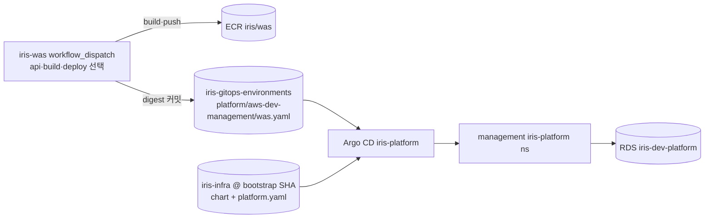

# deploy-platform

Iris control plane(Control API·Build Worker·Deploy Worker)을 management EKS에 배포합니다. chart 구조는 [iris-platform](../../helm/charts/iris-platform/README.md)을 봅니다.



## 1. 최초 1회 준비

1. foundation apply로 RDS `iris-dev-platform`과 Secrets Manager `iris-dev-platform-db`를 만듭니다. 비밀번호는 write-only라 state에 없습니다.
2. bootstrap(새 infra SHA)으로 Application `iris-platform`을 만듭니다. digest가 없으므로 ServiceAccount·NetworkPolicy만 생깁니다.
3. 아래 Secret을 `iris-platform` namespace에 만듭니다. 값은 셸 히스토리·파일에 남기지 않습니다.

```bash
export AWS_PROFILE=<PROFILE> AWS_REGION=ap-northeast-2
K="kubectl --kubeconfig .generated/kubeconfig-aws-dev-management.json --context iris-dev-management -n iris-platform"
SECRET_ARN=$(terraform -chdir=terraform/environments/aws/dev/foundation output -raw platform_db_secret_arn)
DATABASE_URL=$(aws secretsmanager get-secret-value --secret-id "$SECRET_ARN" --query SecretString --output text \
  | python3 -c 'import json,sys,urllib.parse as u; s=json.load(sys.stdin); print(f"postgresql+asyncpg://{s["username"]}:{u.quote(s["password"],safe="")}@{s["host"]}:{s["port"]}/{s["dbname"]}?ssl=require")')

$K create secret generic iris-api-env --from-literal=DATABASE_URL="$DATABASE_URL" --dry-run=client -o yaml | $K apply -f -
# Build Worker: GitHub App(소스 읽기)
$K create secret generic iris-build-worker-env --from-literal=DATABASE_URL="$DATABASE_URL" \
  --from-literal=GITHUB_APP_ID=<ID> --from-file=GITHUB_APP_PRIVATE_KEY=<PEM_PATH> \
  --from-literal=GITHUB_PUBLIC_INSTALLATION_ID=<ID> --dry-run=client -o yaml | $K apply -f -
# Deploy Worker: GitOps 쓰기 App + Argo CD project role 토큰(iris-svc-project:iris-deploy-reader)
$K create secret generic iris-deploy-worker-env --from-literal=DATABASE_URL="$DATABASE_URL" \
  --from-literal=GITOPS_APP_ID=<ID> --from-file=GITOPS_APP_PRIVATE_KEY=<PEM_PATH> \
  --from-literal=GITOPS_INSTALLATION_ID=<ID> --from-literal=ARGOCD_TOKEN=<TOKEN> --dry-run=client -o yaml | $K apply -f -
unset DATABASE_URL
```

- 비밀이 아닌 설정(AWS_REGION·CODEBUILD_PROJECT·ARTIFACT_BUCKET·BASE_DOMAIN·GITOPS_REPOSITORY·ARGOCD_SERVER_URL)은 [platform.yaml](../../clusters/aws-dev-management/values/platform.yaml)에 있습니다.
- RDS는 `rds.force_ssl=1`이라 `?ssl=require`가 필요합니다.

## 2. 배포 (iris-was Actions → Deploy platform)

1. main에서 workflow를 수동 실행하고 api·build-worker·deploy-worker 중 배포할 것을 고릅니다.
2. workflow가 이미지를 한 번 빌드해 `iris/was`에 push하고, 고른 컴포넌트의 digest만 GitOps 파일에 커밋합니다.
3. Argo CD가 migration Job(api 배포 시)을 먼저 실행하고 Deployment를 갱신합니다.

DB 스키마 변경은 api 이미지의 migration으로만 적용됩니다. 스키마를 바꾼 커밋을 Worker만 배포하면 안 됩니다.

## 다른 레포의 서비스 추가

레포마다 자기 digest 파일만 씁니다(`platform/aws-dev-management/<repo>.yaml`, `{"components": {"<키>": {"digest": "sha256:..."}}}`).

1. iris-infra PR: `terraform/config/platform-ecr-repositories.json`에 레포가 있는지 확인(ECR·Argo valueFiles 목록의 원본), `clusters/aws-dev-management/values/platform.yaml`에 `components.<키>`(repository·command·port 등) 추가 → merge 후 bootstrap.
2. account: `github_ecr_publishers.<repo>`에 그 레포 OIDC subject로 publisher 역할 추가(관리자 apply).
3. 그 레포에 iris-was의 `deploy-platform.yml`·`scripts/build-push-ecr.sh`를 복사해 `ECR_REPOSITORY`·`VALUES_FILE`·역할 이름·컴포넌트 선택만 바꾸고 secret `GITOPS_APP_PRIVATE_KEY`를 넣습니다.
4. `iris-<키>-env` Secret을 만듭니다.

infra에 정의하지 않은 키의 digest는 무시되므로, 1보다 먼저 배포해도 platform 전체가 깨지지 않습니다.

## 3. 확인과 rollback

```bash
$K get deploy,job,ingress
curl -sS -o /dev/null -w '%{http_code}\n' https://api.likelion.uk/healthz   # 204
```

rollback은 GitOps 파일을 이전 커밋으로 되돌리는 커밋(`git revert`)입니다. migration은 자동으로 되돌리지 않습니다.

## DB 직접 접근 (SSM bridge)

RDS는 management 노드와 SSM bridge에서만 5432로 접근할 수 있습니다. workload(사용자 앱)는 열지 않습니다.

```bash
F=terraform/environments/aws/dev/foundation
aws ssm start-session --target "$(terraform -chdir=$F output -raw ssm_bridge_instance_id)" \
  --document-name AWS-StartPortForwardingSessionToRemoteHost \
  --parameters "host=$(terraform -chdir=$F output -raw platform_db_endpoint),portNumber=5432,localPortNumber=15432"
# 다른 터미널. 비밀번호는 Secrets Manager iris-dev-platform-db
psql "host=127.0.0.1 port=15432 dbname=iris user=iris sslmode=require"
```

운영자 IAM에는 bridge 인스턴스와 `AWS-StartPortForwardingSessionToRemoteHost`에 대한 `ssm:StartSession`, Secrets Manager 읽기 권한이 필요합니다.

## 비밀번호 교체

자동 교체는 없습니다. foundation 변수 `platform_db_password_version`을 올려 apply하면 RDS와 Secrets Manager가 함께 바뀝니다. 이후 1-3의 Secret을 다시 만들고 `$K rollout restart deploy`로 반영합니다.

## 후속

- Deploy Worker IAM(Pod Identity `deploy-worker`): ECR `iris/services/*` 태그용 역할이 아직 없습니다.
- Argo CD 서버는 자체 서명 TLS입니다. Deploy Worker의 `ARGOCD_SERVER_URL`(https) 신뢰 설정을 확정해야 합니다.
- RDS Multi-AZ는 끈 상태입니다(`multi_az = false`).
