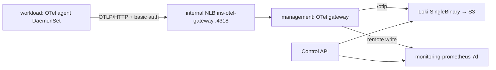

# 로그·메트릭 수집 (Loki · OTel Collector)

사용자 서비스(`svc-*`)의 로그와 CPU·메모리·네트워크 메트릭을 management EKS에 모읍니다. 조회는 management 안에서만 합니다.



- 저장: Loki(로그 7일, S3 `iris-dev-loki-*`, Pod Identity `observability/loki`), 기존 kube-prometheus-stack Prometheus(management만 7일·remote write 수신).
- NLB는 workload private subnet(`10.40.32.0/20`, `10.40.48.0/20`)에서만 받습니다. 사용자 Pod는 iris-service chart `restrict-egress`가 VPC로 나가는 것을 막습니다.
- Loki·Prometheus는 ClusterIP이며 인증이 없습니다. management에는 플랫폼 코드만 실행된다는 전제입니다.

## 적용 순서

1. Terraform: account(CI 권한) → foundation(Loki 버킷·역할) → management(Pod Identity 연결). 각 stack은 로컬 plan 검토 후 apply합니다.
2. Secret `otel-write-auth`를 **bootstrap 전에** 두 클러스터 `observability`에 같은 값으로 만듭니다. 없으면 gateway가 시작하지 못하고 bootstrap이 addon health를 기다리다 실패합니다.

   ```bash
   PW="$(openssl rand -base64 32)"
   aws ssm put-parameter --name /iris/dev/observability/write-password --type SecureString --value "$PW"
   for target in aws-dev-management aws-dev-workload; do
     kubectl --kubeconfig ".generated/kubeconfig-$target.json" -n observability \
       create secret generic otel-write-auth --from-literal=WRITE_PASSWORD="$PW"
   done
   ```

3. main 머지 후 그 SHA로 bootstrap합니다([EKS 운영 경로](eks-access.md)). management에 `iris-management-loki`, `iris-management-opentelemetry-collector` Application이 생깁니다.
4. gateway NLB DNS를 workload agent values에 넣습니다(`kubectl -n observability get svc opentelemetry-collector`).

## 검증

```bash
kubectl -n observability get pods,svc,pvc      # loki-0, opentelemetry-collector 1개, PVC Bound
# workload 노드 또는 observability Pod에서
curl -so /dev/null -w '%{http_code}\n' -X POST http://<GATEWAY_NLB_DNS>:4318/v1/logs   # 401
curl -so /dev/null -w '%{http_code}\n' -u otel:"$PW" -H 'Content-Type: application/json' -d '{}' \
  -X POST http://<GATEWAY_NLB_DNS>:4318/v1/logs                                          # 200
```

Grafana(port-forward)의 Loki 데이터 소스 "Test"가 성공해야 합니다.

## 수집 확인

management에서 port-forward 후 조회합니다(`svc-*` 서비스가 하나 이상 떠 있어야 합니다).

```bash
kubectl -n observability port-forward svc/loki 13100:3100 &
kubectl -n observability port-forward svc/monitoring-prometheus 19090:9090 &

curl -s localhost:13100/loki/api/v1/label/iris_release_id/values          # release ID 목록
curl -sG localhost:13100/loki/api/v1/query_range \
  --data-urlencode 'query={k8s_namespace_name="svc-<ID>",k8s_container_name="app"}' --data-urlencode limit=5
curl -sG localhost:19090/api/v1/query \
  --data-urlencode 'query=count by (__name__)({k8s_namespace_name=~"svc-.*"})'   # 아래 3종 + target_info
```

| 확인 | 기대 |
|---|---|
| Loki index 라벨 | `iris_release_id`, `k8s_namespace_name`, `k8s_pod_name`, `k8s_container_name`, `service_*` |
| 메트릭 | `k8s_pod_cpu_time_seconds_total`, `k8s_pod_memory_working_set_bytes`, `k8s_pod_network_io_bytes_total{direction}` |
| 수집 지연 | 로그 수 초, 메트릭 30초(kubeletstats 주기) + batch |
| agent | `kubectl -n observability logs ds/opentelemetry-collector-agent` 에 `401`·`refused` 없음 |

### 2026-10-02 검증 결과

- gateway NLB: workload `observability` Pod에서 인증 없이 401, `otel-write-auth`로 200(inline 평문 htpasswd 동작).
- 샘플 Pod(`svc-test`, 라벨 `iris/release-id: "1"`): 위 라벨·메트릭 모두 확인, 로그 본문은 CRI prefix가 제거된 원문.
- `restrict-egress`: gateway NLB·다른 노드·VPC resolver·IMDS 차단, 외부 443·클러스터 DNS 허용.
- **한계**: Pod가 **자기 노드 IP**에는 닿습니다(VPC CNI NetworkPolicy가 Pod→자기 노드 트래픽을 막지 않음). kubelet 10250은 인증이 필요해 401이고, agent는 hostPort를 열지 않습니다. hostNetwork/hostPort 서비스를 노드에 추가할 때 이 점을 고려합니다.
- Loki S3 쓰기는 Pod Identity 자격증명으로 동작합니다(IRSA 불필요).

## 비밀번호 교체

SSM 값을 바꾸고 두 Secret을 다시 만든 뒤 gateway → agent 순서로 `kubectl -n observability rollout restart`합니다. 그사이 agent 전송은 401로 재시도합니다.

## 장애 확인

| 증상 | 확인 |
|---|---|
| agent 로그 `401` | 두 클러스터 Secret 값이 다름 |
| agent 연결 실패 | NLB `loadBalancerSourceRanges`, LBC가 만든 SG 규칙 |
| gateway → Loki `429` | 스트림 상한(`per_stream_rate_limit` 256KB/s) 초과. 그 스트림만 거절 |
| Loki S3 `AccessDenied` | Pod Identity association(`observability/loki`), foundation 역할 신뢰 조건 |
| Loki·Prometheus PVC Pending | gp3 EBS는 AZ에 묶입니다. 볼륨 AZ의 노드 상태 확인 |

## 철거

agent → gateway·Loki Application 순서로 삭제합니다. PVC와 S3 버킷은 남으므로 직접 정리합니다. 버킷은 `force_destroy`가 없고 foundation plan guard가 삭제를 막습니다(⚠️ 비우면 로그가 모두 사라집니다).
