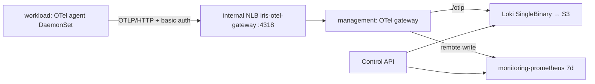
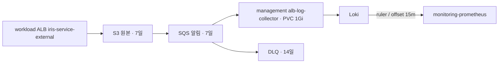

# 로그·메트릭 수집 (Loki · OTel Collector)

사용자 서비스(`svc-*`)의 로그와 CPU·메모리·네트워크 메트릭을 management EKS에 모읍니다. 조회는 management 안에서만 합니다.



- 저장: Loki(로그 7일, S3 `iris-dev-loki-*`, Pod Identity `observability/loki`), 기존 kube-prometheus-stack Prometheus(management만 7일·remote write 수신).
- NLB는 workload private subnet(`10.40.32.0/20`, `10.40.48.0/20`)에서만 받습니다. 사용자 Pod는 iris-service chart `restrict-egress`가 VPC로 나가는 것을 막습니다.
- Loki·Prometheus는 ClusterIP이며 인증이 없습니다. management에는 플랫폼 코드만 실행된다는 전제입니다.

## 적용 순서

1. Terraform: account(CI 권한) → foundation(Loki 버킷·역할) → management(Pod Identity 연결). 각 stack은 로컬 plan 검토 후 apply합니다.
2. Secret `otel-write-auth`를 **bootstrap 전에** 두 클러스터 `observability`에 같은 값으로 만듭니다. 없으면 gateway가 시작하지 못하고 bootstrap이 addon health를 기다리다 실패합니다.

   ```bash
   PW="$(openssl rand -base64 32)"
   aws ssm put-parameter --name /iris/dev/observability/write-password --type SecureString --value "$PW"
   for target in aws-dev-management aws-dev-workload; do
     kubectl --kubeconfig ".generated/kubeconfig-$target.json" -n observability \
       create secret generic otel-write-auth --from-literal=WRITE_PASSWORD="$PW"
   done
   ```

3. main 머지 후 Argo가 동기화합니다([EKS 운영 경로](eks-access.md)). management에 `iris-management-loki`, `iris-management-opentelemetry-collector` Application이 생깁니다.
4. gateway NLB DNS를 workload agent values에 넣습니다(`kubectl -n observability get svc opentelemetry-collector`).

## 검증

```bash
kubectl -n observability get pods,svc,pvc      # loki-0, opentelemetry-collector 1개, PVC Bound
# workload 노드 또는 observability Pod에서
curl -so /dev/null -w '%{http_code}\n' -X POST http://<GATEWAY_NLB_DNS>:4318/v1/logs   # 401
curl -so /dev/null -w '%{http_code}\n' -u otel:"$PW" -H 'Content-Type: application/json' -d '{}' \
  -X POST http://<GATEWAY_NLB_DNS>:4318/v1/logs                                          # 200
```

Grafana(port-forward)의 Loki 데이터 소스 "Test"가 성공해야 합니다.

## 수집 확인

management에서 port-forward 후 조회합니다(`svc-*` 서비스가 하나 이상 떠 있어야 합니다).

```bash
kubectl -n observability port-forward svc/loki 13100:3100 &
kubectl -n observability port-forward svc/monitoring-prometheus 19090:9090 &

curl -s localhost:13100/loki/api/v1/label/iris_release_id/values          # release ID 목록
curl -sG localhost:13100/loki/api/v1/query_range \
  --data-urlencode 'query={k8s_namespace_name="svc-<ID>",k8s_container_name="app"}' --data-urlencode limit=5
curl -sG localhost:19090/api/v1/query \
  --data-urlencode 'query=count by (__name__)({k8s_namespace_name=~"svc-.*"})'   # 아래 3종 + target_info
```

| 확인 | 기대 |
|---|---|
| Loki index 라벨 | `iris_release_id`, `k8s_namespace_name`, `k8s_pod_name`, `k8s_container_name`, `service_*` |
| 메트릭 | `k8s_pod_cpu_time_seconds_total`, `k8s_pod_memory_working_set_bytes`, `k8s_pod_network_io_bytes_total{direction}` |
| 수집 지연 | 로그 수 초, 메트릭 30초(kubeletstats 주기) + batch |
| agent | `kubectl -n observability logs ds/opentelemetry-collector-agent` 에 `401`·`refused` 없음 |

### 2026-10-02 검증 결과

- gateway NLB: workload `observability` Pod에서 인증 없이 401, `otel-write-auth`로 200(inline 평문 htpasswd 동작).
- 샘플 Pod(`svc-test`, 라벨 `iris/release-id: "1"`): 위 라벨·메트릭 모두 확인, 로그 본문은 CRI prefix가 제거된 원문.
- `restrict-egress`: gateway NLB·다른 노드·VPC resolver·IMDS 차단, 외부 443·클러스터 DNS 허용.
- **한계**: Pod가 **자기 노드 IP**에는 닿습니다(VPC CNI NetworkPolicy가 Pod→자기 노드 트래픽을 막지 않음). kubelet 10250은 인증이 필요해 401이고, agent는 hostPort를 열지 않습니다. hostNetwork/hostPort 서비스를 노드에 추가할 때 이 점을 고려합니다.
  - 2026-10-02 `restrict-egress` 적용 Pod에서 자기 노드 스캔: 열림 22(sshd, 등록 키 없음), 9100(node-exporter 메트릭), 8162·61678(aws-node 메트릭), 10249·10256(kube-proxy 메트릭·healthz), 10250(kubelet, 401). 닫힘 80·2703(Pod Identity Agent는 link-local 주소에서만 수신), 61679·61680.
  - 열린 포트는 인증정보 없이 노드·CNI 메트릭만 노출합니다. dev에서는 허용하고, 막아야 하면 노드 호스트 방화벽(Pod CIDR → 노드 포트 차단)이나 사용자 전용 노드그룹을 검토합니다.
- Loki S3 쓰기는 Pod Identity 자격증명으로 동작합니다(IRSA 불필요).

## 비밀번호 교체

SSM 값을 바꾸고 두 Secret을 다시 만든 뒤 gateway → agent 순서로 `kubectl -n observability rollout restart`합니다. 그사이 agent 전송은 401로 재시도합니다.

## 장애 확인

| 증상 | 확인 |
|---|---|
| agent 로그 `401` | 두 클러스터 Secret 값이 다름 |
| agent 연결 실패 | NLB `loadBalancerSourceRanges`, LBC가 만든 SG 규칙 |
| gateway → Loki `429` | 스트림 상한(`per_stream_rate_limit` 256KB/s) 초과. 그 스트림만 거절 |
| Loki S3 `AccessDenied` | Pod Identity association(`observability/loki`), foundation 역할 신뢰 조건 |
| Loki·Prometheus PVC Pending | gp3 EBS는 AZ에 묶입니다. 볼륨 AZ의 노드 상태 확인 |

## 철거

agent → gateway·Loki Application 순서로 삭제합니다. PVC와 S3 버킷은 남으므로 직접 정리합니다. 버킷은 `force_destroy`가 없고 foundation plan guard가 삭제를 막습니다(⚠️ 비우면 로그가 모두 사라집니다).

## ALB 외부 트래픽 v2

이 섹션은 새 경로의 적용·확인 절차입니다. **현재 dev 런타임 검증 결과가 아닙니다.** 기존 Loki/Prometheus에 ALB access logs의 정규화 로그와 recording rules를 추가합니다. [지표 계약](../../contracts/service-traffic.md)에 이름·라벨·단위·지연·결측 의미가 있습니다.

### Collector 이미지 CI 설정

`.github/workflows/alb-log-collector.yml`은 이미지 게시와 digest 변경 PR 생성까지 담당합니다. collector 빌드 입력이 바뀔 때만 자동 게시·PR 갱신을 수행합니다. digest-only PR 머지는 Helm 검증만 수행하고 Terraform apply와 collector 재빌드를 건너뜁니다. 이미지 PR만 머지해도 collector가 활성화되지는 않으며, 아래 적용 절차의 ALB logging/root `albTraffic.enabled`/Argo revision·sync 작업은 별도로 수행합니다.

운영 설정과 실제 실행은 해당 승인 후 진행합니다.

1. account의 **실제** `github_ecr_publishers`에 `alb-log-collector` 키를 추가합니다. 기존 `was`/`error-check-agent` 등 모든 키를 보존하세요. infra의 실제 OIDC prefix를 사용하고 `repository_names = ["iris/alb-log-collector"]`로 제한합니다. 기존 일반 publisher 모듈이 역할/inline policy 두 개를 생성합니다. account plan에서 이 두 생성만 있는지 확인 후 관리자가 apply합니다. Terraform CI용 Admin 역할은 사용하지 않습니다.
2. Actions 변수 `ALB_COLLECTOR_ECR_PUSH_ROLE_ARN`에 `github_ecr_publisher_role_arns["alb-log-collector"]`를 등록합니다. 기존 `AWS_ACCOUNT_ID`, `AWS_REGION=ap-northeast-2`와 collector values repository가 일치해야 합니다.
3. fine-grained PAT를 `iris-infra` 저장소만 선택하여 Contents **Read/Write**, Pull requests **Read/Write**, 만료일을 지정해 생성합니다. 필요하면 조직 승인을 완료하고 Actions secret `ALB_COLLECTOR_PR_TOKEN`에 등록합니다. 토큰은 코드/대화에 남기지 않습니다. 만료·갱신 담당자는 등록한 계정 소유자로 지정하고 계정 이관 시 교체합니다. PAT가 있어야 생성·갱신 PR의 CI가 자동 실행됩니다([GitHub 문서](https://docs.github.com/en/actions/concepts/security/github_token)).
4. workflow 도입 후 첫 PR에서 `collector-ci`를 확인하고 main 보호 규칙에 필수 검사와 **Require branches to be up to date before merging**을 지정합니다. 자동화 계정은 bypass 대상에 포함하지 않습니다. admin 수동 bypass는 이 보호의 보장 범위 밖입니다. 규칙 설정 전에는 오래된 green PR 방지를 운영 완료로 보고하지 않습니다.
5. 아래 수동 실행에서 `force_rebuild=true`로 최초 이미지를 게시합니다. main 이외 ref의 수동 실행은 로컬 검증만 합니다. 빌드 입력 변경이 main에 들어온 뒤에는 자동 게시합니다.

```bash
gh workflow run alb-log-collector.yml --ref main -f force_rebuild=true
gh run list --workflow alb-log-collector.yml --limit 5
gh pr list --head automation/alb-log-collector-image
```

설정 누락은 ECR 게시 전에 실패합니다. 실제 PAT 인증/API 실패는 이미지를 게시한 뒤 발생할 수 있으며, 이 경우 ECR 이미지는 남지만 PR 갱신은 실패합니다. AWS 게시 실패·잘못된 digest는 PR을 만들지 않습니다. 최신 main과 입력이 달라지거나 더 최신 실행이 있으면 이전 결과를 건너뜁니다. 누락·실패 복구는 설정/로그를 확인한 뒤 **최신 main**에서 `force_rebuild=true`로 재실행합니다. 자동화 브랜치에 수동 변경이 섞이면 보존 후 분리해야 하며 자동 덮어쓰지 않습니다.

자동화 PR은 values의 digest와 image lock entry 두 개만 변경하는지 확인하고 `collector-ci` 및 기존 Terraform/Helm 검사를 확인합니다. fixture digest는 게시 증거가 아닙니다. 실제 이미지 확인 이후 아래 적용 절차를 수행합니다. CI 문제의 복구는 새 workflow 비활성화·미머지 이미지 PR 닫기·이전 배포 digest 유지이며, ECR 이미지와 기존 수집 데이터는 삭제하지 않습니다.



### 적용 전 조건·순서

코드 구현 승인은 이미지 게시·Terraform apply·GitOps 배포·main push·workflow 실행을 포함하지 않습니다. Terraform 배포 입력이 바뀐 main push는 CI apply를 유발하며, 수동 실행은 main에서 `force_apply=true`를 선택해야 apply합니다. 아래 작업은 해당 배포 승인 후 수행합니다.

1. account → foundation → management 순서로 plan을 검토하고 apply합니다. account에 전용 CI IAM policy 1개를 추가하므로 기존 IAM policy 크기 제한을 유지합니다. foundation의 `alb_access_logs` output으로 실제 bucket/prefix/queue/DLQ/role을 확인하고 cluster values와 일치시키세요. management의 `observability/alb-log-collector` Pod Identity association과 agent가 필요합니다. 버킷은 ALB와 같은 리전의 SSE-S3 전용 버킷이며 LBC가 ALB를 소유합니다.
2. workload ALB 이름·ARN과 TargetGroup 태그를 확인합니다. ELB `describe-target-groups --load-balancer-arn <ARN>`, `describe-tags --resource-arns <TG_ARN>` 결과에 `elbv2.k8s.aws/cluster=iris-dev-workload`, `ingress.k8s.aws/stack=iris-service-external`, `ingress.k8s.aws/resource=svc-<ID>/...:...`가 있어야 합니다. 이름의 축약 문자열로 서비스 ID를 추정하지 않습니다. 조회와 SQLite 저장이 모두 성공해야 ALB 식별자·TG 매핑·조회 시각이 함께 갱신됩니다. 확인한 ALB 식별자와 삭제·교체된 TG의 마지막 정상 매핑은 7일 캐시하여 이전 ALB의 지연 로그를 처리합니다. 기존 PVC에는 account·region·cluster·group이 같아야 하며 재시작 후 첫 정상 조회 전에 큐를 소비하지 않습니다.
3. collector 이미지를 Linux 노드 아키텍처에 맞게 빌드하고 실제 ECR `iris/alb-log-collector`에 게시합니다. 게시 계정·리전·digest를 `aws ecr describe-images`로 확인하세요. runtime role에는 이미지 게시 권한이 없고 기존 WAS publisher의 권한 범위도 유지합니다. 실제 digest를 `clusters/aws-dev-management/values/alb-log-collector.yaml`과 `helm/images.lock.json`의 **repository 이름 키**에 기록합니다. fixture digest를 배포 입력으로 사용하지 않습니다.
4. `python3 scripts/check-alb-traffic.py --deployment`, 기존 `make helm-check`, 이미지 build/run 검증을 수행합니다. `--deployment`는 실제 values/lock 일치를 확인하지만 ECR에 이미지가 존재한다는 증명은 별도입니다. Kubernetes API server dry-run과 실제 gp3 PVC·Pod Identity·collector 준비 상태도 확인합니다.
5. root `iris-addons` Application의 Helm values에서 `albTraffic.enabled=true`를 설정하고 새 Git revision에 맞춥니다. 기본값은 false입니다. 이 스위치는 collector Application과 Loki ruler overlay를 함께 활성화합니다. collector Application은 image digest를 필수로 요구합니다. sync wave 0에서 rules ConfigMap/collector를 만든 뒤 wave 1에서 Loki에 `fake/traffic.yaml`을 마운트합니다. collector chart의 `rules.enabled=true`를 유지해야 합니다.
6. management에서 collector 1개 Ready, PVC Bound, Loki Ready, ruler rule 로딩과 remote write를 확인합니다. Loki rule source는 읽기 전용 ConfigMap, 작업 디렉터리와 remote-write WAL은 기존 Loki PVC입니다. Loki ServiceMonitor에 `release=monitoring`을 붙이며 Grafana Agent/MetricsInstance를 추가하지 않습니다.
7. 마지막으로 workload baseline의 `externalAlb.accessLogs.enabled=true`를 적용합니다. bucket·prefix는 foundation output과 동일해야 합니다. anchor Ingress가 `access_logs.s3.*` 속성을 관리하며 사용자 서비스 chart 변경은 필요 없습니다. LBC 이벤트·ALB 속성·S3 로그 파일·큐 알림을 확인하세요. 기본값은 false입니다. 기존 ALB bucket policy 조건과 실제 log delivery의 호환성은 이 단계에서 확인합니다. **ap-northeast-2 는 2022년 8월 이전에 열린 리전이라 `logdelivery.elasticloadbalancing.amazonaws.com` 서비스 principal 만으로는 `InvalidConfigurationRequest: Access Denied for bucket` 으로 거절된다.** 리전 ELB 계정 principal(`arn:aws:iam::600734575887:root`, 같은 prefix의 `s3:PutObject` 만)이 버킷 정책에 있어야 한다(2026-10-03 dev 에서 확인). 거절되면 LBC 가 같은 ALB 그룹의 모든 Ingress 에 `FailedDeployModel` 을 내며 그룹 변경 반영이 막히므로, 켠 직후 anchor Ingress 이벤트를 보고 실패하면 즉시 값을 되돌린다.

현재 저장소에는 실제 collector digest가 없고 두 활성화 스위치가 꺼져 있습니다. 로컬 Docker daemon이 없어 이미지 빌드/컨테이너 실행은 미검증입니다. unit·mock·fixture 검사와 **실제 로컬 Loki 3.6.12/ruler → Prometheus 3.15.0** 통합 검증은 통과했습니다. dev에서는 아직 새 수집 경로를 배포하지 않았습니다.

### dev 트래픽으로 완료 기준 확인

[EKS 접근 절차](eks-access.md)로 management/workload kubeconfig를 준비합니다. 검증 트래픽을 보내는 작업도 배포·운영 승인 범위에 포함하세요. 이미 존재하는 서로 다른 `svc-{id}` 두 서비스를 사용하고 테스트 서비스나 앱 변경은 별도 범위로 다룹니다.

management에서 다음을 확인합니다.

```bash
kubectl --kubeconfig .generated/kubeconfig-aws-dev-management.json -n observability get deployment,pods,pvc
kubectl --kubeconfig .generated/kubeconfig-aws-dev-management.json -n observability logs deploy/alb-log-collector --tail=30
kubectl --kubeconfig .generated/kubeconfig-aws-dev-management.json -n observability port-forward svc/alb-log-collector 18080:8080
# 별도 터미널: /readyz 200, ready 1, mapping timestamp가 최근이어야 함
curl --fail localhost:18080/readyz
curl --fail localhost:18080/metrics
```

두 서비스의 공용 host로 서로 다른 양의 정상 요청과 의도한 4xx·5xx를 보냅니다. 테스트 앱이 지원하는 경로·상태를 사용하며 ALB가 반환하는 실제 상태 코드를 기록합니다. 요청·응답의 알려진 payload를 사용하되 ALB 바이트 필드와 클라이언트 payload 크기가 항상 같다고 가정하지 않습니다. 같은 분에 두 서비스로 보낸 트래픽의 host·상태·시각과 ALB 원본 파일을 대조합니다. 원본 URL/query/IP를 진단 출력에 공유하지 마세요.

S3에 파일이 들어오고 collector가 처리된 뒤 **이벤트 시각으로부터 15분 이상** 기다립니다. ruler 주기와 파일 전달 지연을 포함해 15~25분 확인 창을 잡되 완료 시각을 보장하지 않습니다. 지연이 15분을 초과하면 먼저 품질 지표·큐를 확인합니다.

```bash
# management, 각각 별도 터미널
kubectl --kubeconfig .generated/kubeconfig-aws-dev-management.json -n observability port-forward svc/loki 13100:3100
kubectl --kubeconfig .generated/kubeconfig-aws-dev-management.json -n observability port-forward svc/monitoring-prometheus 19090:9090

# SVC에는 실제 namespace를 설정
SVC=svc-123
curl --fail -sG localhost:13100/loki/api/v1/query_range \
  --data-urlencode "query={job=\"iris-alb-access\",cluster=\"iris-dev-workload\",k8s_namespace_name=\"$SVC\"}" \
  --data-urlencode since=30m --data-urlencode limit=5
curl --fail -sG localhost:19090/api/v1/query \
  --data-urlencode "query={__name__=~\"iris_service_.*\",cluster=\"iris-dev-workload\",k8s_namespace_name=\"$SVC\"}"
# 트래픽 시각을 포함하도록 실제 UTC 평가 시각 범위를 지정해 과거 1분 샘플 조회
curl --fail -sG localhost:19090/api/v1/query_range \
  --data-urlencode "query=iris_service_requests_1m{cluster=\"iris-dev-workload\",k8s_namespace_name=\"$SVC\"}" \
  --data-urlencode start='<UTC_START>' --data-urlencode end='<UTC_END>' --data-urlencode step=60s
```

확인 항목:

| 확인 | 기대 |
|---|---|
| 서비스 분리 | 두 namespace의 요청이 섞이지 않고 TG 태그와 일치 |
| 요청·오류 | 전달된 유효 ALB 로그 건수·상태 코드 집계와 일치; 오류가 없는 유효 분은 0 |
| 바이트 | 해당 분 로그의 `received_bytes`·`sent_bytes` 합과 각 방향 값이 일치 |
| 지연 | 유효 target timing의 5분 평균·p50·p95가 조회됨; `-1`은 제외 |
| 시간 | 이벤트 시간보다 약 15분 뒤의 평가 시각으로 샘플이 기록됨 |
| 결측·중단 | 없는 서비스는 결측; ruler 중단 시 샘플이 비고 기존 값 재합산/0 채움 없음 |
| 재전송 | 승인된 fixture에서 동일 S3 알림 중복·collector 재시작·Loki restart 후 ruler의 요청/바이트가 증가하지 않음 |
| 알림·권한 | 올바른 S3 prefix만 알림, Pod Identity로 읽기 성공, 큐 backlog가 해소됨 |

검증 기록에는 실행 SHA·실제 이미지 digest·테스트 namespace·UTC 트래픽/조회 시각·비밀 없는 쿼리와 결과·진단 상태를 남깁니다. 이 확인이 끝나야 dev 완료 기준을 충족했다고 보고합니다. 이후 iris-was 쿼리/응답 필드, 프론트 패널을 연동합니다.

### 장애·비용·복구

- collector의 `/healthz`는 프로세스 상태이며 `/readyz`는 매핑 최근 5분·큐 poll 최근 2분을 확인합니다. Ready만으로 Loki 전송 성공을 판단하지 않습니다. mapping timestamp, retries/refresh_failures, SQS oldest-message age, Loki ruler evaluation failures·remote-write 실패/대기, PVC 사용량을 함께 봅니다.
- `records_total{reason}`의 `parse`, `source`, `oversize`, `mapping`, `no_target`, `too_old`, `loki_permanent`는 제외·격리 원인입니다. `late`는 15분을 초과해 들어온 로그로 반드시 누락된 로그를 의미하지는 않습니다. `expired`는 7일 만료 당시 로컬 pending 건수로, Loki 수락 후 ack 유실 건도 포함할 수 있어 확정 유실 건수로 보지 않습니다. TG 없는 응답은 서비스를 임의 추정하지 않습니다.
- SQS 일시 오류·Loki 429/5xx·네트워크 장애는 재시도하고, visibility는 120초로 연장합니다. maxReceiveCount 10 이후 SQS가 원본 알림을 DLQ로 이동합니다. 부분 영구 실패의 DLQ 메시지는 객체 위치·원인 합계이며 원문을 포함하지 않습니다. DLQ에는 두 형식이 들어올 수 있습니다. 무조건 bulk redrive하지 말고 원인·원본·Loki 허용 시간을 먼저 확인합니다.
- S3 보존 7일과 Loki 입력 허용 시간은 다릅니다. 기존 ingest limits를 확대하지 않습니다. 너무 오래된/뒤처진 로그는 영구 실패로 격리합니다. replay가 수락돼도 이미 평가한 과거 Prometheus samples를 다시 쓰지 않습니다. 과거 복구는 별도 분석·backfill 설계가 필요합니다.
- ALB 로그·S3·SQS request/storage, 기존 Loki S3/PVC 사용량·CPU 증가와 collector gp3 1Gi/POD 리소스 비용이 추가됩니다. CloudWatch exporter/API polling 비용은 추가하지 않습니다. ALB 로그 파일 수·bytes와 retention으로 사용량을 산정하며 실제 dev 사용량을 확인한 뒤 운영 규모를 결정합니다.
- collector 1Gi PVC의 여유 공간을 확인합니다. 최초 수신 후 7일이 지나면 완료 여부와 무관하게 outbox 본문·객체별 진단을 정리하고 미완료 객체는 `expired`로 종료합니다. 완료/만료 시각부터 14일간 작은 중복 방지 체크포인트를 남기고 ALB/TG 이력은 마지막 확인 후 7일 보관합니다. 정리는 AWS 조회/Loki/DLQ 장애와 독립적으로 60초마다 최대 100객체씩 진행하며, 재수신 때도 만료를 확인합니다. 만료 때문에 새 DLQ 메시지를 보내지 않습니다. SQLite 빈 페이지를 재사용하고 WAL checkpoint를 수행하며 파일 크기를 줄이는 full VACUUM은 하지 않습니다. 정리 backlog·처리량·PVC 여유 공간을 측정하고 트래픽 증가 시 용량을 결정합니다. 동시에 replica를 늘려 SQLite state를 공유하지 않습니다.
- 이번 수정 버전의 코드만 롤백할 때는 collector를 중지하고 PVC를 보존한 채 이전 이미지로 되돌립니다. 기존 DB에 컬럼·테이블만 추가하므로 이전 v2 SQL과 호환되지만 이전 코드는 새 만료 처리/ALB 이력을 사용하지 않습니다. 기존 완료 객체의 보존 기간은 완료 시각이 없어 최초 수신 시각을 기준으로 합니다. 기존 state에는 삭제된 ALB의 이력을 소급해서 만들 수 없습니다. state 초기화·무조건 DLQ redrive는 피하고, 체크포인트 보존 기간 이후 수동 재처리의 재조회·중복 전송 가능성을 확인합니다. 실제 코드 롤백 배포도 별도 승인 작업입니다.
- 롤백은 workload ALB logging을 먼저 끄고, 새 ruler overlay를 제거한 뒤 collector Application을 중지합니다. 기존 Loki/Prometheus·OTel 경로는 유지합니다. `albTraffic.enabled=false`만으로 child Application과 리소스가 제거됐다고 가정하지 말고 prune 정책·각 Application을 확인하세요. PVC·S3 원본은 보존하며 foundation plan guard가 버킷 삭제/교체를 막습니다.
