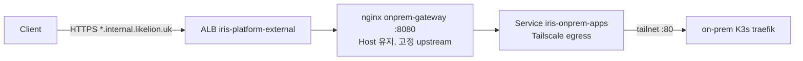

# On-prem gateway (`*.internal.likelion.uk`)

on-prem 타깃 서비스를 management 공용 ALB 로 노출하는 경로입니다. 아래 명령은 실제 클러스터에서 확인한 것이 아닙니다. 첫 적용 때 결과를 이 문서에 반영합니다.



Application `iris-onprem-gateway` 는 `services.onprem.enabled: true` 일 때만 생깁니다.

## 켜는 순서

1. `terraform apply`(foundation) 후 `internal_acm_validation_records` 의 CNAME 을 Cloudflare 에 등록하고 ACM 이 `ISSUED` 인지 확인합니다.

   ```bash
   aws acm describe-certificate --certificate-arn <CERT_ARN> --query Certificate.Status
   ```

2. `clusters/aws-dev-management/values/onprem-gateway.yaml` 의 `certificateArn` 에 `terraform output internal_acm_certificate_arn` 값을 넣고 PR 로 merge 합니다. 비어 있으면 chart 렌더가 `required` 로 실패합니다.
3. Tailscale ACL 은 이름이 아닌 태그로 분리합니다. Service `iris-onprem-apps` 는 `tag:iris-onprem-apps` 를 답니다.

   ```json
   "tagOwners": {"tag:iris-onprem-apps": ["tag:k8s-operator"]},
   "grants": [{"src": ["tag:iris-onprem-apps"], "dst": ["iris-onprem-01"], "ip": ["tcp:80"]}]
   ```

   기존 API egress 는 operator 기본 태그(`tag:k8s`, 설정에 따라 다름)를 쓰므로 `:6443` 만 허용합니다. 실제 태그는 Tailscale admin 에서 확인합니다.
4. on-prem K3s: traefik 80 을 `tailscale0` 에서만 받도록 방화벽(ufw 등)을 걸고 traefik `forwardedHeaders.trustedIPs=100.64.0.0/10` 을 설정합니다. ECR pull, sealed-secrets 키 복원, Argo cluster Secret 제한 해제도 끝나 있어야 합니다.
5. `services.onprem.enabled: true`(+ `server`, `ingressClassName`, `egressDeniedCidrs`) PR 을 merge 하고 [bootstrap](bootstrap.md) 합니다. 이후 확인합니다.

   ```bash
   kubectl -n onprem-gateway get svc iris-onprem-apps -o jsonpath='{.spec.externalName}'  # ts-….tailscale.svc.cluster.local
   aws elbv2 describe-listeners --load-balancer-arn <ALB_ARN> --query 'Listeners[?Port==`443`].Certificates'  # 기본 인증서 불변
   ```
6. Cloudflare 에 `*.internal.likelion.uk` CNAME → `iris-platform-external` ALB DNS 를 DNS only 로 등록합니다.

   ```bash
   kubectl -n onprem-gateway get ingress onprem-gateway -o jsonpath='{.status.loadBalancer.ingress[0].hostname}'
   ```

7. E2E: on-prem 타깃 서비스를 배포하고 확인합니다.

   ```bash
   curl -I https://<NAME>-<ID>.internal.likelion.uk
   ```

## 롤백

- 노출만 끊기: Cloudflare 의 `*.internal.likelion.uk` 레코드를 삭제합니다.
- gateway 제거: `services.onprem.enabled: false` PR 후 Application 을 지우고, `prune: false` 라 남는 리소스는 `kubectl delete ns onprem-gateway` 로 정리합니다. 삭제는 되돌릴 수 없고(리소스 전체 삭제, operator 가 proxy 정리), operator 가 죽어 있으면 Tailscale finalizer 에서 Terminating 으로 멈출 수 있습니다. Ingress 삭제로 ALB 규칙만 사라지고 공용 ALB 는 유지됩니다.

## 참고

- `iris-onprem-apps` 의 `spec.externalName` 은 Tailscale operator 가 바꾸므로 Argo 가 `ignoreDifferences` 로 무시합니다.
- tailscale-operator 와 API egress(`argocd/iris-onprem-api`)는 GitOps 밖(수동 설치)입니다.
- ALB 로그 수집기는 on-prem 요청을 `svc-*` 로 분류하지 못합니다(target 이 `onprem-gateway`).
