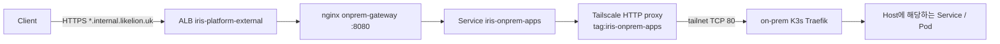

# On-prem gateway (`*.internal.likelion.uk`)

management의 공유 ALB에서 Tailscale HTTP 프록시를 거쳐 온프레미스 K3s Traefik으로 전달합니다. 아래 운영 확인 명령은 적용 후 실행하는 절차이며, 로컬 Helm/Nginx 검증은 실제 클러스터의 통신 성공을 보장하지 않습니다.



## 코드로 활성화

- `helm/gitops/values.yaml`의 `onpremGateway.enabled`는 현재 `true`입니다. 게이트웨이 Application과 management AppProject의 `onprem-gateway`·`tailscale` 목적지 및 `ProxyClass` 권한을 렌더링합니다.
- `services.onprem.enabled`는 현재 `true`입니다. `services/*/onprem`을 읽는 ApplicationSet과 온프레미스 `svc-*` 목적지를 활성화하며, 게이트웨이도 활성화합니다. 게이트웨이만 검증할 때는 이 값을 `false`로 둡니다.
- `clusters/aws-dev-management/values/onprem-gateway.yaml`은 `publicIngress.enabled: true`와 기존 `*.internal.likelion.uk` ACM ARN을 사용합니다. 비공개 경로를 먼저 검증할 때는 이 값을 `false`로 두고 인증된 Kubernetes port-forward로 확인합니다.
- 파일을 검토하고 main에 커밋·푸시하면 main을 추적하는 기존 Argo root가 변경을 동기화해야 합니다. root의 revision이나 Terraform CI를 이 작업에서 변경하지 않으며, bootstrap 재실행도 필요하지 않습니다. 활성화할 때 root/자식 Application의 실제 revision·Sync 상태를 확인합니다.

## 1. Tailscale 선행 조건

기존 management `tailscale` 네임스페이스의 operator와 `ProxyClass` CRD가 준비되어 있어야 합니다. operator가 사용하는 태그는 `tag:iris-operator`, 대상 VM은 `tag:iris-onprem`입니다.

[정책 추가 조각](../../clusters/aws-dev-management/onprem/tailnet-policy-additions.json)을 기존 tailnet 정책에 **병합**합니다. 전체 정책을 이 파일로 교체하지 않습니다. 새 `tag:iris-onprem-apps` 프록시는 온프레미스 TCP 80만 허용하며 기존 API 6443 프록시는 별도로 유지합니다. 기존의 전체 허용 grants/ACL이 있으면 6443 거부가 무효화될 수 있으므로 병합한 전체 정책에서 accept/deny 테스트를 통과시켜야 합니다. 이 파일은 Terraform이 적용하는 리소스가 아닙니다.

Service의 `tailscale.com/proxy-class` annotation은 `iris-onprem-http` ProxyClass를 선택합니다([공식 규격](https://tailscale.com/docs/kubernetes-operator/concepts/proxyclass)). operator가 생성하는 HTTP 프록시 Pod에는 `iris.dev/proxy: onprem-http` 라벨과 requests 100m/128Mi, limits 1 CPU/512Mi를 지정합니다. 프록시 NetworkPolicy는 `onprem-gateway` 네임스페이스의 게이트웨이 Pod에서 오는 TCP 80만 허용합니다. gateway egress도 이 프록시 TCP 80과 kube-dns 53으로 제한합니다. API 프록시를 선택하지 않습니다.

온프레미스에서는 Traefik이 VM의 Tailscale IP TCP 80에서 도달 가능해야 합니다. 애플리케이션 Ingress의 Host는 `<서비스 DNS 라벨>.internal.likelion.uk`여야 합니다. VM 방화벽·Traefik의 forwarded headers 신뢰 설정은 별도 운영 확인 대상입니다. 전달된 헤더의 신뢰는 ALB, 게이트웨이, HTTP 프록시로 제한하는 접근 경로를 전제로 합니다.

## 2. 비공개 경로 확인

`onpremGateway.enabled: true`, `services.onprem.enabled: false`, `publicIngress.enabled: false`를 커밋한 뒤 Argo의 게이트웨이 Sync/Health를 확인합니다. HTTP 프록시는 Tailscale 정책 병합 후 준비될 수 있습니다.

```bash
# management context에서 실행
kubectl -n onprem-gateway get deployments,services
kubectl -n tailscale get pods -l iris.dev/proxy=onprem-http
kubectl -n onprem-gateway get svc iris-onprem-apps -o jsonpath='{.spec.externalName}'
kubectl -n onprem-gateway port-forward --address 127.0.0.1 svc/onprem-gateway 18080:80
```

다른 터미널에서 실제 온프레미스 Ingress가 가진 Host로 요청합니다.

```bash
curl -i http://127.0.0.1:18080/healthz
curl -i -H 'Host: <서비스 DNS 라벨>.internal.likelion.uk' http://127.0.0.1:18080/
curl -i -H 'Host: unknown.example' http://127.0.0.1:18080/
```

`/healthz`의 200은 게이트웨이 프로세스 확인입니다. 앱 응답으로 end-to-end를 별도로 확인하며 알 수 없는 Host는 404여야 합니다. 온프레미스가 중단되면 앱 요청은 502/504가 될 수 있습니다. DNS 변경은 최대 30초 캐시 후 다시 조회합니다. 비공개 모드에서 Ingress는 새로 렌더링되지 않습니다.

## 3. 공개 경로 활성화

foundation 코드가 관리하는 기존 `*.internal.likelion.uk` ACM 인증서를 사용합니다. 필요한 AWS 변경은 기존 Terraform 코드·CI 경로로 처리하며, 게이트웨이 Helm이 인증서를 만들지 않습니다. `internal_acm_validation_records`의 검증 CNAME을 Cloudflare에 DNS only로 등록하고 인증서 상태가 `ISSUED`인지 확인합니다. `PENDING_VALIDATION` 상태에서는 공개 모드를 켜지 않습니다.

`clusters/aws-dev-management/values/onprem-gateway.yaml`에서 `certificateArn`을 foundation의 `internal_acm_certificate_arn` 값으로 채우고 `publicIngress.enabled: true`를 커밋합니다. 공개 모드는 서울 리전 ACM ARN과 비어 있지 않은 ALB CIDR 목록이 필요합니다. Argo가 공유 ALB 그룹의 Ingress 규칙을 추가합니다. 기존 anchor와 기본 인증서 설정은 이 차트에서 변경하지 않습니다.

이후 Cloudflare에서 `*.internal.likelion.uk` CNAME을 management 공유 ALB DNS로 지정합니다. 이 단계에서는 DNS only를 사용합니다.

```bash
kubectl -n onprem-gateway get ingress onprem-gateway
curl -i https://<서비스 DNS 라벨>.internal.likelion.uk/
```

TLS 인증서, Host/path/query, 앱 응답과 WebSocket을 실제 경로에서 확인합니다. CNI NetworkPolicy 적용, operator의 proxy 생성 및 readiness, Traefik 라우팅과 OCI 이미지 실행은 클러스터에서 별도 검증합니다.

## 4. 웹을 통한 온프레미스 배포 활성화

웹의 ONPREM 선택은 기존 타깃 API의 ID 하나를 서비스 생성 요청의 `targetIds`로 전달합니다. 서비스를 만든 뒤 배포 요청이 한 번이라도 있었다면 배포 타깃을 바꿀 수 없으므로 새 서비스를 만듭니다. Deploy Worker는 `services/{id}/onprem`에 값을 쓰며, 아래 준비가 완료되어야 ApplicationSet이 실제 앱을 생성합니다. 온프레미스 ApplicationSet은 `services.onprem.chartRevision`(`iris-service-0.6.0`, Deployment·롤링만)을 쓰며 Argo Rollouts를 설치하지 않습니다([Argo Rollouts runbook](argo-rollouts.md)).

1. Argo에 등록된 서버를 확인합니다. 클러스터 Secret의 `server`, `namespaces`, `clusterResources`만 읽고 `config`나 인증 토큰은 출력하지 않습니다.

   ```bash
   kubectl -n argocd get secret iris-onprem-01-cluster -o jsonpath='{.data.server}' | base64 --decode
   kubectl -n argocd get secret iris-onprem-01-cluster -o jsonpath='{.data.namespaces}' | base64 --decode
   kubectl -n argocd get secret iris-onprem-01-cluster -o jsonpath='{.data.clusterResources}' | base64 --decode
   ```

   등록된 서버와 `services.onprem.server`가 같아야 합니다. `namespaces=iris-onprem-test`만 허용하거나 `clusterResources=false`이면 `svc-{id}` namespace를 자동 생성하는 현재 계약을 충족하지 못합니다. 클러스터 등록 설정과 온프레미스의 서비스 계정 RBAC 모두 `svc-{id}` 및 Namespace 생성을 지원해야 합니다.

2. `helm/gitops/values.yaml`의 서버는 등록된 `https://iris-onprem-api.argocd.svc.cluster.local:6443`, Ingress 클래스는 `traefik`입니다. 같은 namespace와 DNS를 허용하고 RFC1918·tailnet·link-local로 향하는 다른 egress를 차단합니다. 온프레미스에서 [배포 역할](../../clusters/onprem-workload/argocd-service-deployer.yaml)을 적용합니다. 이 역할은 Argo 캐시를 위한 클러스터 읽기와 Namespace 생성·앱 리소스 쓰기를 허용합니다. RBAC 변경, Pod exec, Secret 쓰기는 허용하지 않습니다. 실제 배포 목적지는 AppProject의 `svc-*` 제한으로 관리합니다.

3. K3s 노드의 아키텍처가 빌드 이미지와 맞고 ECR pull 인증이 신규 namespace에서도 동작하는지 확인합니다. 현재 앱 차트는 `imagePullSecrets`를 지정하지 않으므로 노드의 ECR credential provider 또는 namespace의 default ServiceAccount에 연결한 pull Secret이 필요합니다. ECR 인증은 만료되므로 임시 인증으로 테스트한 경우 만료 시각과 재발급 절차를 함께 기록합니다. 사용자 변수를 배포하려면 온프레미스 Sealed Secrets controller가 Worker에서 쓰는 AWS workload 인증서의 키로 복호화할 수 있어야 합니다. 변수 없이 실행하는 정적 portfolio 테스트에는 이 controller가 필요하지 않습니다.

4. root 변경이 반영된 후 `iris-svc-project`의 온프레미스 `svc-*` 목적지와 `iris-svc-onprem-appset`을 확인합니다. 기존 테스트앱을 웹에서 ONPREM으로 생성·배포하고, GitOps 경로, Argo Synced/Healthy, 최종 HTTPS 앱 응답을 연결해서 기록합니다. `/healthz`의 게이트웨이 200만으로 앱 배포 성공을 판단하지 않습니다.

2026-10-03 읽기 전용 운영 확인에서는 internal 와일드카드 DNS와 ISSUED 인증서가 준비돼 있었지만, 해당 인증서는 ALB에 연결되어 있지 않았고 HTTPS listener에는 `api.likelion.uk` 규칙만 있었습니다. deploy-reader로 조회한 `iris-svc-project`도 AWS 목적지만 허용했습니다. 이 확인은 변경 적용 전의 상태이며, 현재 운영 상태는 활성화 후 다시 확인합니다.

## 롤백과 남은 작업

- `publicIngress.enabled: false`로 되돌리면 게이트웨이 NetworkPolicy가 ingress를 차단합니다. **`prune: false`이므로 기존 Ingress/ALB 규칙은 자동 삭제되지 않습니다.** DNS 삭제만으로 기존 ALB 접근을 완전히 막을 수 없습니다. desired state를 되돌린 뒤 별도 승인된 정리 작업에서 게이트웨이 Ingress와 잔여 규칙을 확인합니다. 공유 ALB anchor를 삭제하지 않습니다.
- `onpremGateway.enabled: false`만으로 리소스가 철거되지 않으며, `services.onprem.enabled: true`이면 게이트웨이는 계속 활성 상태입니다. 전체 제거는 두 플래그와 기존 Application·Service·ProxyClass·HTTP 프록시 잔여물을 확인하는 별도 작업입니다. 기존 API Service/ProxyClass, operator와 tailscale 네임스페이스는 보존합니다.
- 현재 AWS/온프레미스 ApplicationSet은 같은 `svc-{id}` 이름을 생성합니다. WAS가 서비스당 타깃 하나만 허용하고 배포 요청 이후 타깃 변경을 막으므로 같은 소스의 AWS/온프레미스 비교에는 서로 다른 서비스를 사용합니다. 온프레미스 쓰기 RBAC·ECR pull·SealedSecrets는 실제 클러스터에서 확인합니다.
- Argo의 온프레미스 API 토큰은 별도 수명 관리가 필요합니다. 기존 48시간 토큰은 자동 갱신되지 않습니다.
- operator가 바꾸는 `iris-onprem-apps.spec.externalName`은 Argo가 무시합니다. operator/API egress는 현재 이 차트의 소유 리소스가 아닙니다.
- ALB 로그 수집기는 gateway를 target으로 보는 요청을 현재 `svc-*`로 분류하지 못합니다.
