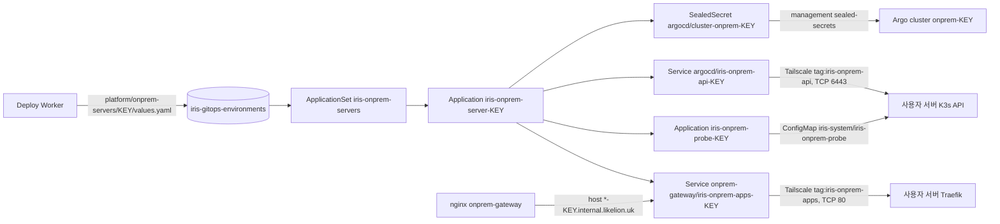

# 사용자 온프레미스 서버 등록

사용자가 자기 Ubuntu 서버를 배포 대상으로 붙이는 경로의 인프라 쪽 절차입니다. 레포 간 계약은 iris-was `docs/onprem-server-registration-contract.md`, 결정 배경은 iris-was ADR 0029 입니다. 아래 확인 명령은 적용 후 실행하는 절차이며 `make helm-check`·`make tf-test` 의 렌더·mock 검사는 실제 클러스터·tailnet·IAM 동작을 보장하지 않습니다. 첫 적용 때 결과를 이 문서에 반영합니다.



| 구성 | 위치 |
|---|---|
| management Sealed Secrets controller | addon `iris-management-sealed-secrets`, [sealed-secrets runbook](sealed-secrets.md#management-controller-온프레미스-서버-등록) |
| 서버별 chart | `helm/charts/iris-onprem-server`, probe `helm/charts/iris-onprem-probe` |
| ApplicationSet·AppProject | `helm/gitops/templates/onprem-servers.yaml`(`onpremServers.enabled`), `iris-svc-project` 의 `onprem-*` 목적지 |
| 게이트웨이 라우팅·공용 ProxyClass | `helm/charts/iris-onprem-gateway`(0.3.0) |
| Tailscale 정책 조각 | `clusters/aws-dev-management/onprem/tailnet-policy-additions.json` |
| ECR pull 역할 | `terraform/environments/aws/dev/foundation/onprem-ecr-pull.tf`, CI 권한 `terraform/account/aws/ci-control-api.tf` |
| 서비스 chart | `iris-service` 0.8.0(`imagePullSecrets`), 서버용 pin `onpremServers.chartRevision` |

## 적용 순서

순서를 바꾸면 등록한 서버가 `FAILED` 로 끝나거나 서비스 sync 가 실패합니다. `onpremServers.enabled` 는 마지막(6단계)에 켭니다.

### 0. merge 와 root revision

이 변경을 main 에 merge 합니다. `onpremServers.enabled` 는 false 라 서버 경로는 아직 꺼져 있고, 바로 반영되는 것은 다음입니다.

- management Sealed Secrets controller(새 addon)
- 게이트웨이 0.3.0: `-{serverKey}` host 라우팅, ProxyClass `iris-onprem-api`. 기존 host(`-숫자` 로 끝남)는 지금 upstream 그대로입니다
- Deploy Worker 의 선택 env `ARGOCD_PROBE_TOKEN`(Secret 에 키가 없으면 비어 있음)

live root 가 SHA 에 고정돼 있으면 merge SHA 로 `make bootstrap CLUSTER=aws-dev-management` 를 다시 실행합니다([eks-access](eks-access.md)). `iris-management-sealed-secrets`·`iris-onprem-gateway` 가 Synced/Healthy 인지 봅니다. 기존 온프레미스 서비스 URL 이 계속 응답하는지도 봅니다.

### 1. management Sealed Secrets: 키 백업과 인증서

[sealed-secrets runbook 의 management 절](sealed-secrets.md#management-controller-온프레미스-서버-등록)대로 키를 `iris/dev/sealed-secrets-key-management` 에 백업하고, 공개 인증서를 WAS `PLATFORM_SEALED_SECRETS_CERT` 로 준비합니다. workload 인증서(`SEALED_SECRETS_CERT`)와 바꾸지 않습니다.

### 2. iris-service 0.8.0 tag

서버의 서비스 values 에는 `imagePullSecrets` 가 들어가고 0.7.0 schema 는 이 키를 거절합니다. merge commit 에 tag 를 만듭니다.

```bash
git fetch origin && git tag -a iris-service-0.8.0 <merge commit SHA> -m "iris-service chart 0.8.0" && git push origin iris-service-0.8.0
```

AWS 서비스의 `services.chartRevision` 은 이 작업과 상관없습니다([argo-rollouts](argo-rollouts.md) 의 순서를 따로 따릅니다). 서버용 ApplicationSet 은 `onpremServers.chartRevision` 을 씁니다.

### 3. Tailscale 정책과 가입 키

1. [정책 조각](../../clusters/aws-dev-management/onprem/tailnet-policy-additions.json)을 기존 tailnet 정책에 **병합**합니다(교체 금지). 추가되는 것: `tag:iris-onprem-api`(owner `tag:iris-operator`)와 `tag:iris-onprem-api → tag:iris-onprem:6443` grant, `tag:iris-onprem` 출발을 막는 deny 테스트.
2. 병합한 전체 정책에서 테스트가 통과해야 저장됩니다. `tag:iris-onprem` 을 출발지로 쓰는 기존 grant/ACL(전체 허용 포함)이 있으면 `src: tag:iris-onprem` deny 테스트가 실패합니다. 기존 VM 에 그런 출발 권한이 필요하다면 저장하지 말고 사용자 서버용 태그를 따로 두는 계약 변경을 먼저 합니다. 같은 태그를 쓰면 사용자 서버도 그 권한을 갖습니다.
3. `tag:iris-onprem` 의 tagOwners 에 가입 키를 만드는 사람(또는 `autogroup:admin`)이 있어야 합니다.
4. 관리 콘솔 Settings → Keys 에서 auth key 를 만듭니다: **Reusable**, **Pre-approved**, Tags `tag:iris-onprem`, Ephemeral 끔. 만료(최대 90일)를 기록하고 만료 전에 교체합니다. 값은 출력·채팅에 남기지 않고 WAS env Secret 의 `ONPREM_TAILSCALE_AUTH_KEY` 에만 넣습니다. 이 키를 가진 누구나 `tag:iris-onprem` 장치를 tailnet 에 넣을 수 있으므로 2번의 출발 deny 가 전제입니다(서버마다 1회용 키는 계약 §10 의 다음 단계).

operator 의 egress 프록시는 Service 마다 `tailscale.com/tags` 로 `tag:iris-onprem-api`·`tag:iris-onprem-apps` 를 받습니다. operator 자신의 태그(`tag:iris-operator`)가 두 태그의 owner 여야 프록시가 가입합니다.

### 4. Terraform (IAM)

1. 관리자가 account 를 먼저 적용합니다(CI 역할이 `iris-dev-onprem-ecr-pull` 을 관리할 권한). account 는 CI 가 적용하지 않습니다.
2. main merge 로 foundation 이 자동 적용됩니다(이미 0단계 merge 에 포함됐다면 account 적용 뒤 `force_apply` 로 다시 실행). 실패했다면 account 적용 전에 돌았는지 봅니다.
3. 출력을 확인합니다.

   ```bash
   make tf-init STACK=aws/dev/foundation
   terraform -chdir=terraform/environments/aws/dev/foundation output -raw onprem_ecr_pull_role_arn
   aws iam get-role --role-name iris-dev-onprem-ecr-pull --query 'Role.AssumeRolePolicyDocument'
   aws iam get-role-policy --role-name iris-dev-control-api --policy-name assume-onprem-ecr-pull
   ```

Control API 는 Pod Identity 세션에서 다시 AssumeRole 하므로(role chaining) 세션은 최대 1시간입니다. ECR 토큰이 그 세션보다 오래 쓰이는지는 첫 적용 때 확인합니다(서버 CronJob 은 6시간 주기).

### 5. WAS 설정

| 설정 | 값 | 넣는 곳 |
|---|---|---|
| `PLATFORM_SEALED_SECRETS_CERT` | 1단계 management 인증서(PEM) | WAS env Secret |
| `ONPREM_TAILSCALE_AUTH_KEY` | 3단계 auth key | WAS env Secret(비밀) |
| `ONPREM_ECR_PULL_ROLE_ARN` | 4단계 `onprem_ecr_pull_role_arn` | WAS env Secret |
| `ARGOCD_PROBE_TOKEN` | 6단계 뒤 발급(아래) | Deploy Worker Argo reader Secret(`deployWorker.argocdSecret`) |

API·Worker 를 다시 시작해 값을 읽게 합니다([deploy-platform](deploy-platform.md)).

### 6. 켜기

1. 별도 PR 로 `helm/gitops/values.yaml` 의 `onpremServers.enabled` 를 `true`, `onpremServers.chartRevision` 을 `iris-service-0.8.0` 으로 바꿔 merge 합니다(tag 가 있어야 합니다). 필요하면 root revision 을 갱신합니다.
2. 새 AppProject 가 생긴 뒤 probe 조회 token 을 발급해 5단계 Secret 에 `ARGOCD_PROBE_TOKEN` 으로 넣고 Deploy Worker 를 다시 시작합니다. 서버를 등록하기 전에 끝냅니다(없으면 Worker 가 probe 를 못 읽어 15분 뒤 `FAILED`).

   ```bash
   argocd proj role create-token iris-onprem-probe iris-deploy-reader --token-only
   ```

3. 확인합니다.

   ```bash
   M="--kubeconfig .generated/kubeconfig-aws-dev-management.json --context iris-dev-management"
   kubectl $M -n argocd get appproject iris-onprem-servers iris-onprem-probe iris-svc-project
   kubectl $M -n argocd get applicationset iris-onprem-servers iris-svc-onprem-servers-appset iris-svc-onprem-appset
   kubectl $M -n argocd get appproject iris-svc-project -o jsonpath='{.spec.destinations}'
   ```

## 서버 하나 확인

웹·CLI 로 테스트 서버를 등록하고 설치 명령을 실행한 뒤(`k3x9q2ma` 자리에 실제 serverKey):

```bash
KEY=k3x9q2ma
kubectl $M -n argocd get application iris-onprem-server-$KEY iris-onprem-probe-$KEY
kubectl $M -n argocd get sealedsecret cluster-onprem-$KEY          # SYNCED True
kubectl $M -n argocd get secret cluster-onprem-$KEY -o jsonpath='{.metadata.labels}{"\n"}{.data.server}' ; echo   # config 는 출력하지 않습니다
kubectl $M -n argocd get svc iris-onprem-api-$KEY -o jsonpath='{.spec.externalName}'; echo
kubectl $M -n onprem-gateway get svc iris-onprem-apps-$KEY -o jsonpath='{.spec.externalName}'; echo
kubectl $M -n tailscale get pods -l 'iris.dev/proxy in (onprem-api,onprem-http)'
argocd cluster get onprem-$KEY        # Connection Status: Successful
```

- probe Application 이 Synced/Healthy 이고 WAS 서버 상태가 `CONNECTED` 여야 합니다.
- 그 서버를 타깃으로 서비스를 만들어 배포하고 `services/{id}/onprem-$KEY/values.yaml`, `svc-{id}` Application Synced/Healthy, Pod 의 이미지 pull 성공, `curl -i https://<label>-$KEY.internal.likelion.uk/` 응답을 기록합니다.
- 다른 서버의 key 로 바꾼 host 는 그 서버로만 가고, 등록되지 않은 key 는 게이트웨이에서 502 입니다. 기존 서비스 host 는 계속 기존 VM 으로 갑니다.
- tailnet 에서 서버 장치가 `tag:iris-onprem` 만 갖고, 서버에서 다른 tailnet 장치로 연결이 안 되는지 봅니다(`tailscale ping` 이 아니라 TCP 연결로 확인).

## 문제 확인

| 증상 | 확인 |
|---|---|
| SealedSecret `no key could decrypt secret` | WAS 가 workload 인증서로 봉인했거나 키를 잃었습니다. `PLATFORM_SEALED_SECRETS_CERT` 를 확인하고 서버에서 설치 명령을 다시 실행합니다 |
| probe `ComparisonError`·`connection refused`·timeout | API 프록시 Pod(`iris.dev/proxy=onprem-api`) 준비, tailnet grant(6443), 서버 K3s `--tls-san` 에 tailnet FQDN, 서버 방화벽 |
| probe `x509` 오류 | 봉인한 `config` 의 `tlsClientConfig.serverName` 이 tailnet FQDN 인지, `caData` 가 서버 K3s CA 인지 |
| probe `forbidden` | 서버의 `iris-system` 에서 `iris-argocd` SA 권한(install.sh 5단계) |
| `iris-onprem-server-*` 렌더 실패 | data 파일의 key·디렉터리·clusterName·FQDN 이 맞지 않습니다(chart 가 거절). Worker 출력 확인 |
| 서비스 sync 실패 `imagePullSecrets` 거절 | `onpremServers.chartRevision` 이 0.8.0 이상인지 |
| 게이트웨이 502 | key 의 egress Service·HTTP 프록시가 없거나 서버 Traefik 이 응답하지 않습니다 |

## 되돌리기

- **서버 하나**: WAS 에서 삭제하면 Worker 가 디렉터리를 지우고 ApplicationSet 이 Application 을 지웁니다. finalizer 가 cluster Secret·egress Service·probe Application 을 지웁니다. probe 는 finalizer 가 없어 서버의 ConfigMap 은 남습니다.
- **기능 전체**: `onpremServers.enabled: false` 로 되돌려도 root(`iris-addons`)는 prune 하지 않아 AppProject·ApplicationSet 이 남습니다. 지울 때는 사용자 서비스를 지우지 않도록 ApplicationSet 을 orphan 으로 지웁니다. `--cascade=orphan` 없이 지우면 생성된 `svc-*`·서버 Application 과 서버의 앱까지 지워집니다.

  ```bash
  kubectl $M -n argocd delete applicationset iris-svc-onprem-servers-appset iris-onprem-servers --cascade=orphan
  ```

- **게이트웨이**: 0.3.0 을 되돌리면 `-{serverKey}` host 도 기존 VM 으로 갑니다(서버 앱은 응답하지 않음). 기존 host 동작은 0.2.0 과 같습니다.
- **IAM**: `onprem-ecr-pull.tf` 를 되돌리는 PR 이 CI 에서 역할을 지웁니다. 그 전에 WAS 의 `ONPREM_ECR_PULL_ROLE_ARN` 을 비워 서버 CronJob 이 오류 대신 빈 응답을 받게 합니다.
- **Tailscale**: 조각에서 추가한 grant·tagOwners 를 정책에서 빼고 auth key 를 폐기합니다. 이미 가입한 서버 장치는 콘솔에서 지웁니다.
- management Sealed Secrets controller 와 키는 남겨 둡니다(지우면 복구할 수 없습니다).

## 기존 서버 이전 (나중, 계약 §9)

새 경로 E2E 가 통과하기 전까지 기존 VM(`iris-onprem-01`)의 경로는 바꾸지 않습니다: 타깃 `onprem`, ApplicationSet `iris-svc-onprem-appset`(`services/*/onprem`, `services.onprem.server`), 손으로 만든 `argocd/iris-onprem-api` egress 와 cluster Secret `iris-onprem-01-cluster`, 게이트웨이 기본 upstream.

이전은 별도 작업입니다.

1. 기존 VM 에서 install.sh 를 실행해 서버 데이터(`platform/onprem-servers/<key>`)를 만들고 probe 가 `CONNECTED` 인지 봅니다. 같은 K3s 에 붙는 cluster Secret 이 둘(`iris-onprem-01-cluster`, `cluster-onprem-<key>`)이 되지만 server URL 이 달라 Argo 는 다른 클러스터로 봅니다.
2. 서비스마다 새 타깃으로 옮기는 WAS 마이그레이션(새 host `-<key>`)을 하고, `services/<id>/onprem` 이 모두 사라졌는지 확인합니다. 같은 `svc-{id}` 이름을 두 ApplicationSet 이 동시에 만들지 않게 디렉터리 이동은 한 커밋에서 합니다.
3. 그 뒤 `services.onprem.enabled: false`, 손으로 만든 egress·cluster Secret 삭제, 게이트웨이 기본 upstream 정리, 정책 조각의 기존 VM 전용 항목 정리를 따로 PR 로 합니다.
