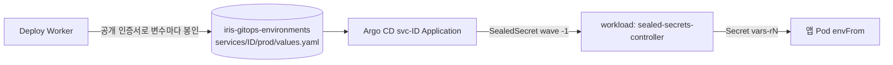

# Sealed Secrets (사용자 환경변수)

사용자 서비스의 환경변수를 Git 에 평문으로 두지 않고 앱에 넘기는 경로입니다([ADR 0004](../decisions/0004-user-variables-sealed-secrets.md)). 아래 명령은 배포 후 실제 클러스터에서 확인한 것이 아닙니다. 첫 적용 때 결과를 이 문서에 반영합니다.



- controller: workload `kube-system` 의 `sealed-secrets-controller`(1 replica). management 에도 같은 pin·values 로 하나 더 있지만 용도와 키가 다릅니다([아래](#management-controller-온프레미스-서버-등록)).
- 키는 처음 시작할 때 한 번 만들고 자동으로 바꾸지 않습니다(`keyrenewperiod: "0"`). Deploy Worker 는 인증서 하나로 봉인합니다.
- 봉인 범위는 strict(namespace `svc-{service_id}` + Secret 이름)입니다. 다른 곳으로 옮긴 SealedSecret 은 풀리지 않습니다.

## 첫 적용 순서

1. PR 을 main 에 merge 하고 `iris-service-0.6.0` tag 가 merge commit 에 있는지 확인합니다. tag 가 없으면 `chartRevision` 이 가리키는 chart 를 못 찾아 모든 사용자 서비스가 sync 에 실패합니다. **tag 를 만들기 전에 bootstrap 하지 않습니다.**
2. [eks-access](eks-access.md) 절차로 두 터널을 열고 최신 main 을 checkout 한 뒤 `make bootstrap CLUSTER=aws-dev-management` 를 실행합니다. bootstrap 이 `iris-workload-sealed-secrets` Application 의 Synced/Healthy 를 기다립니다.
3. controller 를 확인합니다.

   ```bash
   K="--kubeconfig .generated/kubeconfig-aws-dev-workload.json --context iris-dev-workload"
   kubectl $K -n kube-system rollout status deploy/sealed-secrets-controller
   kubectl $K get crd sealedsecrets.bitnami.com
   kubectl $K -n kube-system get secret -l sealedsecrets.bitnami.com/sealed-secrets-key
   ```

4. **키를 백업합니다**(아래). 백업 전에는 사용자 변수를 쓰는 서비스를 배포하지 않습니다.
5. 공개 인증서를 Deploy Worker 에 전달합니다(아래).

## 키 백업 (필수)

controller 키(Secret `sealed-secrets-key*`)를 잃으면 Git 의 모든 SealedSecret 을 풀 수 없습니다. 서비스를 다시 배포해 새 키로 봉인해야 합니다. 키는 비밀이므로 Git·채팅에 두지 않습니다.

```bash
kubectl $K -n kube-system get secret -l sealedsecrets.bitnami.com/sealed-secrets-key -o yaml > /tmp/sealed-secrets-key.yaml
chmod 600 /tmp/sealed-secrets-key.yaml
aws secretsmanager create-secret --name iris/dev/sealed-secrets-key --secret-string file:///tmp/sealed-secrets-key.yaml
shred -u /tmp/sealed-secrets-key.yaml 2>/dev/null || rm -P /tmp/sealed-secrets-key.yaml
```

복구는 새 controller 가 뜨기 전에 백업한 Secret 을 `kube-system` 에 `kubectl apply` 하고 controller Pod 를 재시작합니다.

## 공개 인증서 꺼내기

공개 인증서는 비밀이 아닙니다. Deploy Worker 의 설정(`SEALED_SECRETS_CERT`)으로 넘깁니다.

```bash
kubectl $K -n kube-system get secret -l sealedsecrets.bitnami.com/sealed-secrets-key \
  -o jsonpath='{.items[0].data.tls\.crt}' | base64 -d
```

`kubeseal --fetch-cert --controller-name sealed-secrets-controller --controller-namespace kube-system` 도 같은 값을 줍니다. 키를 교체하지 않으므로 인증서도 바뀌지 않습니다.

## 점검

```bash
kubectl $K get sealedsecret -A
kubectl $K -n svc-12 describe sealedsecret vars-r345    # Synced 조건과 오류 메시지
kubectl $K -n kube-system logs deploy/sealed-secrets-controller | tail
```

- `no key could decrypt secret`: 다른 키·다른 namespace/이름으로 봉인했거나 키를 잃었습니다. 서비스를 다시 배포합니다.
- SealedSecret 이 Degraded 이면 Argo sync 가 wave -1 에서 멈추고 Pod 이 새로 뜨지 않습니다. 이전 Pod 은 그대로 서비스합니다.
- 변수 값은 출력하지 않습니다. `kubectl get secret -o yaml` 은 base64 평문을 보여 주므로 필요할 때만 씁니다.

## management controller (온프레미스 서버 등록)

사용자가 등록한 온프레미스 서버의 Argo cluster Secret(`argocd/cluster-onprem-{serverKey}`)을 Git 에 봉인해 두려고 management 에도 controller 를 둡니다([온프레미스 서버 등록](onprem-server-registration.md)). 사용자 변수용 workload controller 와 **키가 다르고** 섞어 쓰지 않습니다.

| | workload | management |
|---|---|---|
| Application | `iris-workload-sealed-secrets` | `iris-management-sealed-secrets` |
| values | `clusters/aws-dev-workload/values/sealed-secrets.yaml` | `clusters/aws-dev-management/values/sealed-secrets.yaml`(같은 내용, `make helm-check` 가 비교) |
| 봉인하는 것 | `svc-{id}/vars-r{release}` | `argocd/cluster-onprem-{serverKey}` 의 `config` |
| WAS 설정 | `SEALED_SECRETS_CERT` | `PLATFORM_SEALED_SECRETS_CERT` |
| 키 백업 | `iris/dev/sealed-secrets-key` | `iris/dev/sealed-secrets-key-management` |

1. root 가 이 변경을 담은 revision 을 가리키면(필요하면 `make bootstrap CLUSTER=aws-dev-management` 재실행) `iris-management-sealed-secrets` 가 Synced/Healthy 인지 봅니다.

   ```bash
   M="--kubeconfig .generated/kubeconfig-aws-dev-management.json --context iris-dev-management"
   kubectl $M -n kube-system rollout status deploy/sealed-secrets-controller
   kubectl $M get crd sealedsecrets.bitnami.com
   kubectl $M -n kube-system get secret -l sealedsecrets.bitnami.com/sealed-secrets-key
   ```

2. 키를 백업합니다. 백업 전에는 서버 등록 ApplicationSet(`onpremServers.enabled`)을 켜지 않습니다. 키를 잃으면 등록된 모든 서버의 cluster Secret 을 다시 만들 수 없고, 서버마다 설치 명령을 다시 실행해야 합니다.

   ```bash
   kubectl $M -n kube-system get secret -l sealedsecrets.bitnami.com/sealed-secrets-key -o yaml > /tmp/sealed-secrets-key-management.yaml
   chmod 600 /tmp/sealed-secrets-key-management.yaml
   aws secretsmanager create-secret --name iris/dev/sealed-secrets-key-management --secret-string file:///tmp/sealed-secrets-key-management.yaml
   shred -u /tmp/sealed-secrets-key-management.yaml 2>/dev/null || rm -P /tmp/sealed-secrets-key-management.yaml
   ```

3. 공개 인증서를 WAS 의 `PLATFORM_SEALED_SECRETS_CERT` 로 넘깁니다. workload 인증서(`SEALED_SECRETS_CERT`)와 바꿔 넣으면 cluster Secret 이 풀리지 않습니다(`no key could decrypt secret`).

   ```bash
   kubectl $M -n kube-system get secret -l sealedsecrets.bitnami.com/sealed-secrets-key \
     -o jsonpath='{.items[0].data.tls\.crt}' | base64 -d
   ```

복구와 점검은 위 workload 절차와 같고 `$K` 대신 `$M` 을 씁니다. 봉인 범위는 strict(namespace `argocd` + 이름 `cluster-onprem-{serverKey}`)입니다.
